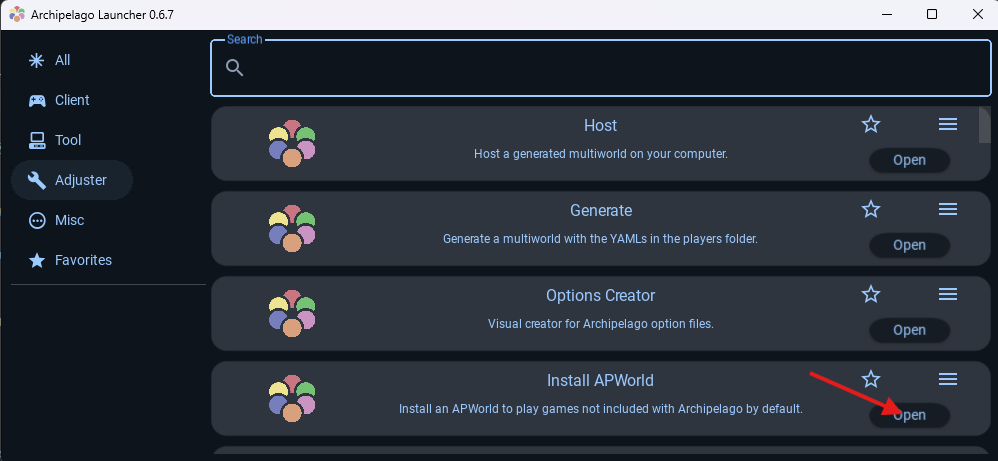
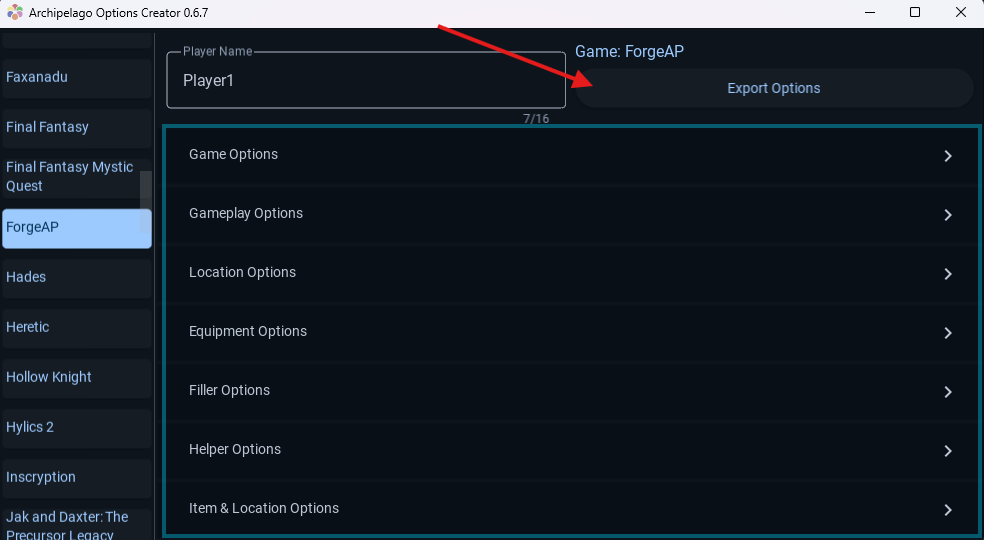
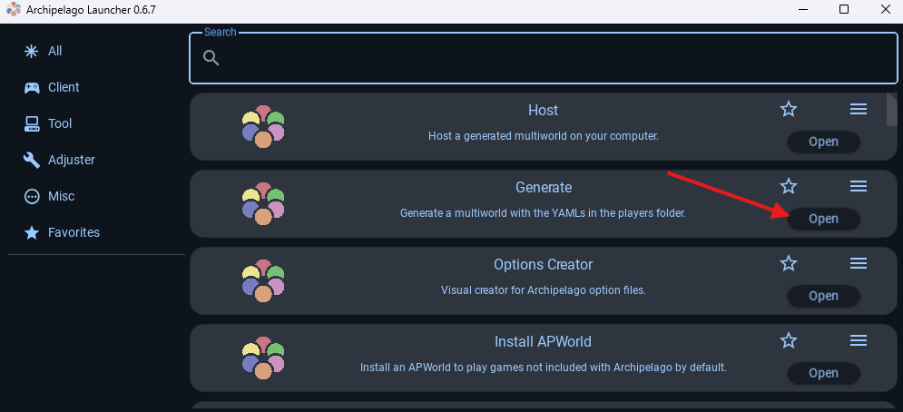
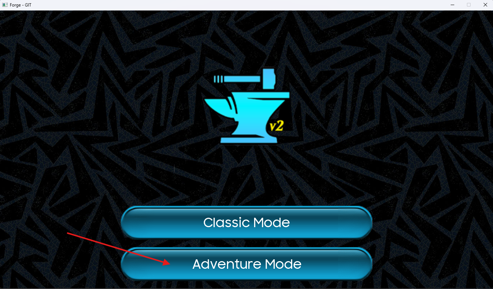
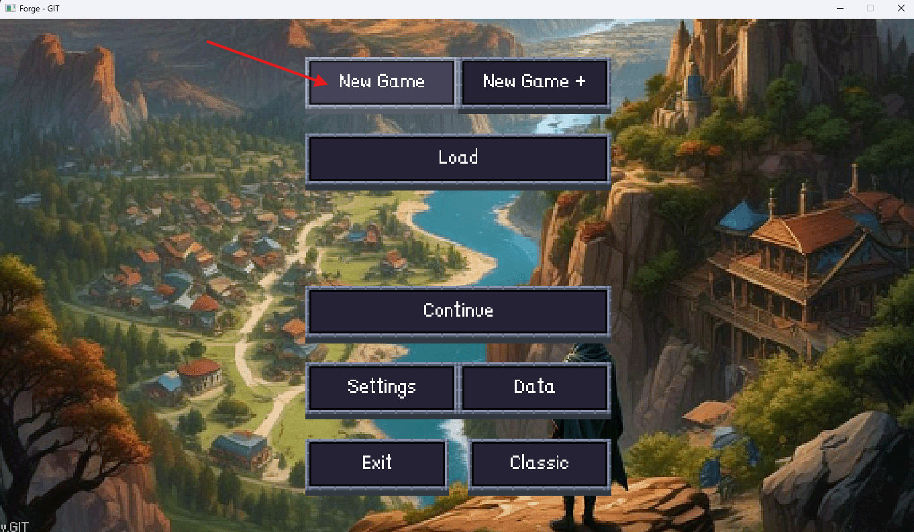
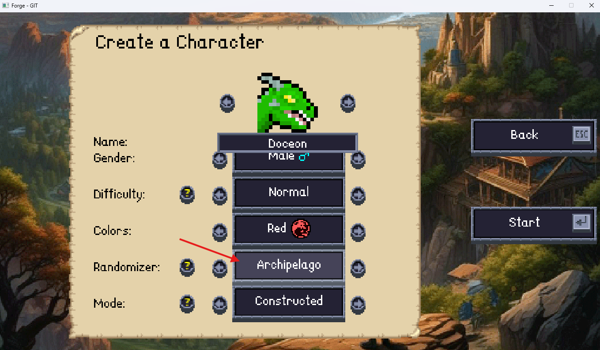
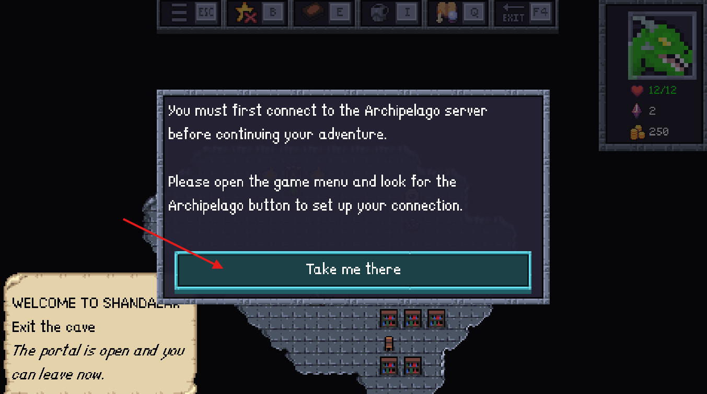
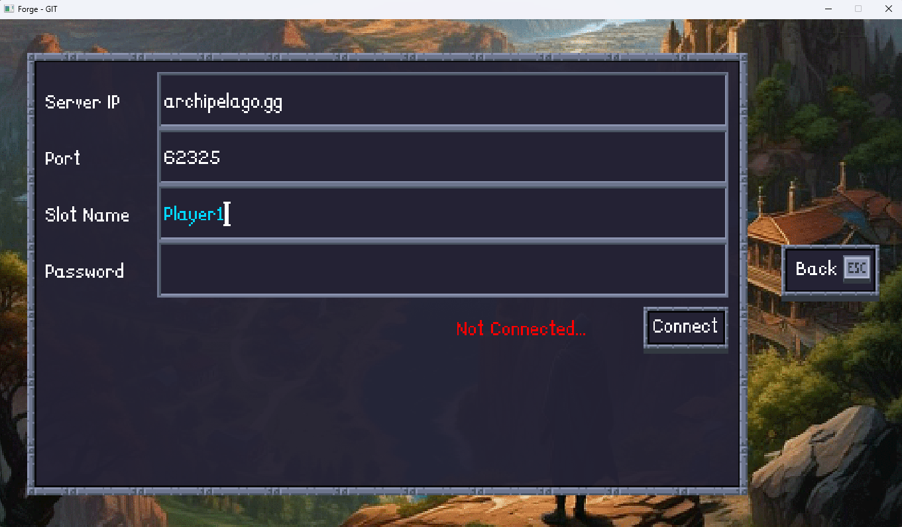
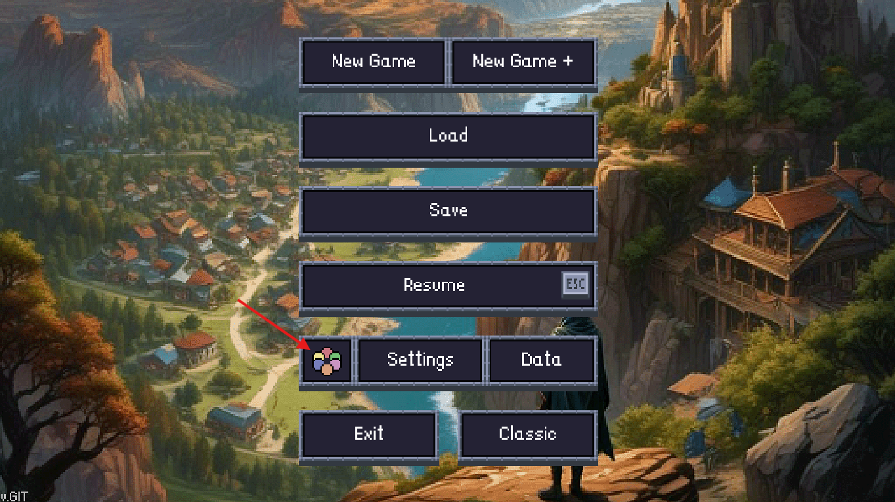

## Offline Randomizer

### 🎲 Randomized Adventure Mode
Play the Adventure mode on the Shandalar world but with randomized items & biomes. Unlock each region of the map as you progress.
- All cards outside your starting deck will be locked by default.
- Biomes, cards and equipment unlocks are randomized and can be unlocked by completing various objectives in the game such as:
    - Collecting cards
    - Completing quests
    - Winning battles
    - Competing at Inn events
    - Defeating bosses and mini-bosses
- Equipment shop contents are fully randomized and (almost) any piece of equipment in game can show up.
- The Leather Boots in your starting equipment are removed regardless of difficulty, all entities' base speeds are increased to compensate.

## Archipelago Multiworld Randomizer
Archipelago is a cross-game modification system which randomizes different games, then uses the result to build a single
unified multi-player game. Items from one game may be present in another, and you will need your fellow players to find
items you need in their games to help you complete your own.

### 🏝️ Archipelago Adventure Mode
Play the Randomized Adventure Mode using Archipelago to shuffle all items and locations amongst a pool of other Archipelago compatible games.
 Archipelago adds the following locations to the pool:
- Buying items from equipment & item shops
- Defeating a mini-boss
- Defeating a castle boss
- Winning a certain number of battles per region
- Completing a certain number of quests per region
- Finishing a certain number of inn events per region
- Collecting a certain number of cards per rarity

This Archipelago implementation adds the following rewards and filler rewards to the pool:
- Region unlocks in the form of "region runes", one per color of region
- Gold in various amounts
- Mana Shards in various amounts
- Bronze/Silver/Gold Challenge Coins
- Sets of cards including a free matching booster pack
- Max life in various amounts
- Pieces of equipment for the player to wear

This Archipelago implementation has the following win-conditions:
- Defeating X amount of Castle bosses, this defaults to 3 but when set to all 6, Emrakul must also be defeated in order to win.

#### Generating the Archipelago Multiworld
1. Download the [latest release](https://github.com/BramTeurlings/forge-archipelago/releases) of this repository
2. Download the [latest release](https://github.com/BramTeurlings/forge-APWorld/releases) of the Forge APWorld repository
3. Download the [latest release](https://github.com/ArchipelagoMW/Archipelago/releases) of the Archipelago Launcher
4. Install Card-Forge using the `forge-installer-<VERSION>.jar` file bundled in this repository's release files
5. Install the Archipelago Launcher by opening the `Setup.Archipelago.<VERSION>.exe` bundled in Archipelago Launcher release files
6. Open the Archipelago Launcher and click "Open" on the "Install APWorld" option.
7. When prompted, select the `forge.apworld` file downloaded from the Forge APWorld repository release files.
8. Once complete, restart the launcher.
9. Click "Open" on the "Options Creator" option.
10. Scroll down the list on the left side until you see "Forge" or "ForgeAP" and click on it.
11. Configure the options in the section marked in blue as you choose, if you're not sure what to change it is recommended you leave things on their default values.
12. Fill your name into the "Player Name" field.
13. Click on the "Export Options" to export your player profile as a `.yaml` file.
14. Gather the other player's `.yaml` files and place them into the same "Players" folder. In our example, the Archipelago Launcher put them in `C:\ProgramData\Archipelago\Players`.
15. Click on the "Generate" option.
16. If everything went well, the Archipelago Launcher will now have generated a `.zip` file for your Archipelago game. This file can be hosted via [Archipelago's Official Website](https://archipelago.gg/uploads) to start a lobby. Our `.zip` file was generated in `C:\ProgramData\Archipelago\output`.

#### Connecting the game client
17. Assuming you installed Card-Forge in step 4, open `forge-adventure.exe` from the location you installed Card-Forge in.
18. Select "Adventure Mode" on the main menu.
19. Select "New Game" on the Adventure Mode screen.
20. On the New Game screen, choose any settings you want but make sure to scroll down and select "Archipelago" as the "Randomizer" option.
21. Click on the "Start" button.
22. You will be brought to the game's opening scene, click through the tutorial quest with the Adept Black Wizard and walk through the port. The game will alert you that you need to connect to the Archipelago Server. Click the "Take me there" button.
23. Fill in the server host address, the server port and the slot name for your character and click on "Connect". 
24. **Note: You must reconnect to Archipelago each time you load your save file or restart the software. You can find the connection page by opening the Adventure Mode menu on the overworld via the hamburger-menu icon or by pressing the `esc` key. Click on the Archipelago icon to open the connection menu. This button is only available in Archipelago Randomizer mode.**
25. You're all set to go! Enjoy playing the Archipelago!

**Extra: If you want the game to automatically download relevant card-artwork, open the Adventure Mode menu and click on "Settings", then scroll down until you see "Automatically Download Missing Card Art" and enable the option.**

## Cheating
In rare cases due to the nature of the game, it's possible to get stuck, either literally (like, in a wall or something) or other times due to difficulty.
I should note that the generation of the multiworld **should** ensure that you can't be progression locked by Archipelago but nevertheless, sometimes you might have a lot more fun if you just had that little bit of extra gold or that one card you need.

While cheating is obviously not in the spirit of the game, it can genuinely improve certain player's enjoyment so we leave the final call to you.
Here are some handy cheats that will help you progress and speed up your game. Note that each of these commands must be filled into the in-game console, you can open the console by pressing `F9`:
1. `give gold [amount]` > gives the specified amount of gold to the player.
2. `give shards [amount]` > gives the specified amount of shards to the player.
3. `give item cheat` > gives the player a completely busted piece of equipment that will auto-win almost any combat on the first turn, don't forget to equip it, you can un-equip it at any time.
4. `give boosters [set-code] [amount]` > gives the player the specified amount of packs of the specified set code. Set codes can be found online.
5. `heal full` > fully heals your character
6. `teleport to poi Spawn` > teleports you to the starting cave, handy if you ever get literally stuck. It's case sensitive so don't forget the capital "S".