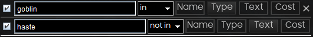

# Advanced Search

Forge implements many ways to help you find the cards you want in your ever growing collection.

Pressing Ctrl+Enter in current search adds another editable search bar.  
Here's how searching for all Goblins without Haste-related abilities might look:

Click the "X" in the upper right corner of each search widget to remove that filter from the filter stack.

Find-as-you-type is implemented for Deck Editor tables. Just start typing while the table has focus and the next card with a matching string in its name will be highlighted. If more than one card matches, hit Enter to select the next matching card. A popup panel will appear with the search string so you know what you are searching for. If no cards match the string, the string will be highlighted in red. Find-as-you-type mode is automatically exited after 5 seconds of inactivity, or hit Escape to exit find-as-you-type mode immediately.

## Additional information

Another way to filter is using [Scryfall-like syntax](https://scryfall.com/docs/syntax) in the collection search bar.

If no operators are passed between tokens, Forge will assume it is joined by `and`. For example, `t:cat t:warrior t:creature` will search for "creatures that are a cat **and** a warrior". Make sure to use `|` or `or` for your queries, as well as parentheses `( )` when needed.

Keywords can be negated by prefixing a minus sign `-`. For example, `t:creature -t:goblin` will search for "creatures that aren't goblins".

If no keywords are used, Forge will search in their name, type and oracle text for the passed values. For exemple, `(cat | warrior)` will search for cards that has `cat` or `warrior` anywhere in their name, type, or oracle text. Not that it is not bounrd, so it will also match on "catastrophe". This type of search can be negated too. For exemple, `lightning -bolt` will search for card with "lightning and not bolt in their name, types, or oracle text", or `(t:cat | t:warrior) -(orc | angel | phyrexian)` will search for "cat or warrior cards that don't have orc, angel, or phyrexian in their name, types, or oracle text.

## Implemented keywords

### Colors

#### Keyword(s): `color`, `c`

You can find cards that are a certain color using the `c:` or `color:` keyword. Both keywords accepts full color names like blue or the abbreviated color letters `w`, `u`, `r`, `b` and `g`.

You can use many nicknames for color sets: all guild names (e.g. `azorius`), all shard names (e.g. `bant`), all college names (e.g., `quandrix`), all wedge names (e.g. `abzan`), and the four-color nicknames `chaos`, `aggression`, `altruism`, `growth`, `artifice` are supported.

Use `c` or `colorless` to match colorless cards, and `m`, `multi`, or `multicolor` to match multicolor cards.

You can use comparison expressions (`>`, `<`, `>=`, `<=`, and `!=`) to check against ranges of colors.

*Exemples:*
`c:rg` - Cards that are at least red and green
`c!gruul` - Cards that exclusively red and green
`color>=uw -c:red` - Cards that are at least white and blue, but not red

### Card Types

#### Keyword(s): `type:`, `t:`

Find cards of a certain card type with the `t:` or `type:` keywords. You can search for any supertype, card type, or subtype.

Using only partial words is allowed.

*Exemples:*
`t:merfolk t:legend` - Legendary merfolk cards
`t:goblin -t:creature` - Goblin cards that aren't creatures

### Card Text

#### Keyword(s): `oracle:`, `o:`

Use the `o:` or `oracle:` keywords to find cards that have specific phrases in their text box.

You must put quotes `" "` around text with punctuation or spaces.

*Exemples:*
`o:"enters tapped"` - Cards that enter the battlefield tapped

#### Keyword(s): `keyword:`, `kw:`

You can use `keyword:` or `kw:` to search for cards with a specific keyword ability.

> Note: Known to be buggy. You can search by oracle text instead.

*Exemples:*
`kw:flying -t:creature` - Noncreatures that have the flying keyword

#### Keyword(s): `name:`

You can find cards with certain words in their name using `name`.

Supports `!` (exact search), `!=` (doesn't contain), and `:` or `=` (contains).

*Exemples:*
`name!Fire` - The card Fire
`name:Phyrexian`- Cards that contain Phyrexian in their name

#### Keyword(s): `is:vanilla`

Find vanilla cratures (Creatures with no abilities).

### Mana Costs

#### Keyword(s): `manavalue`, `mv`, `cmc`

You can find cards of a specific mana value with `manavalue`, `mv`, or `cmc`, comparing with a numeric expression (>, <, =, >=, <=, and !=).

*Exemples:*
`c:u mv=5` - Blue cards with mana value 5

### Power, Toughness, and Loyalty

#### Keyword(s): `power`, `pow`

You can use numeric expressions (>, <, =, >=, <=, and !=) to find cards with certain power using `power` or `pow`.

*Exemples:*
`pow>=8` - Cards with 8 or more power
`pow>tou c:w t:creature` - White creatures that are top-heavy

#### Keyword(s): `toughness`, `tou`

You can use numeric expressions (>, <, =, >=, <=, and !=) to find cards with certain toughness using `toughness` or `tou`.

*Exemples:*
`tou<=4` - Cards with 4 or less thoughness

#### Keyword(s): `loyalty`, `loy`

You can use numeric expressions (`>`, `<`, `=`, `>=`, `<=`, and `!=`) to find cards with certain starting loyalty using `loyalty` or `loy`.

*Exemples:*
`t:planeswalker loy=3` - Planeswalkers that start at 3 loyalty

### Sets (Editions)

#### Keyword(s): `set:`, `s:`, `edition:`, `e`

Use `s:`, `e:`, `set:`, or `edition:` to find cards using their Magic set code.

Examples:
`e:war` - Cards from War of the Spark

#### Keyword(s): `in:` (set)

The `in:` keyword finds cards that appeared in given set code.

Examples:
`in:lea` - Find cards that once appeared in Alpha.

### Rarity

#### Keyword(s): `rarity:`, `r:`

Use `r:` or `rarity:` to find cards by their print rarity. You can search for `land` (`l`) (usually only basic lands), `common` (`c`), `uncommon` (`u`), `rare` (`r`), `mythic` (`m`), and `special` (`s`). You can also use comparison operators like `<` and `>=.`

Examples:
`r:common t:artifact` - Common artifacts
`r>=r`- Cards at rare rarity or above (rares and mythics)

#### Keyword(s): `in:` (rarity)

You can find cards that have been printed in a given rarity using `in:`

Examples:
`in:rare` - Cards that have been printed at rare.

### Multi-faced cards

#### Keyword(s): `is:split`

Find split-faced cards.

#### Keyword(s): `is:flip`

Find flip cards.

#### Keyword(s): `is:transform`

Find cards that transform.

#### Keyword(s): `is:meld`

Find cards that meld.

#### Keyword(s) `is:leveler`

Find cards with Level Up.

### Others

#### Keyword(s): `is:modal`

Find modal cards.

#### Keyword(s): `is:custom`

Find cards from custom sets.

#### Keyword(s) `is:foil`

Find foil cards.

#### Keyword(s) `is:nonfoil`

Find nonfoil cards.
