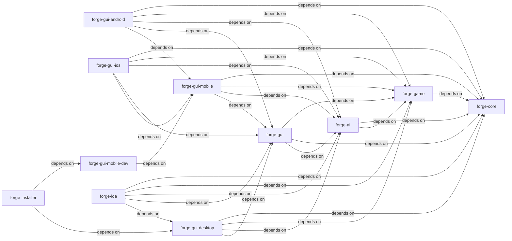

# Architecture

The following guide describes each module in the project, it's purpose, and any particular files and objects of interest.

## Project Structure Dependency Diagram

## forge-ai

The module handles the AI for playing a single round.

There are 3 general areas forming decision making in this module:

1. Is playing a card or ability beneficial?
2. If many choices are beneficial, which is the best choice?
3. Decision branching given current state of game. An example would be deciding to play a spell before playing a land.

### Points of interest

[SpellApiToAi](https://github.com/Card-Forge/forge/blob/e95673e0a211699f2df1d8a535d9636379c59174/forge-ai/src/main/java/forge/ai/SpellApiToAi.java#L13)
handles sending the game event (`ApiType` enum) to the correct AI handler (`SpellAbilityAi` interface implementation).

[SimulationController](https://github.com/Card-Forge/forge/blob/e95673e0a211699f2df1d8a535d9636379c59174/forge-ai/src/main/java/forge/ai/simulation/SimulationController.java#L13)
handles copying the game state, tracking the AI decisions and simulating how the decisions could unfold.

[AiController](https://github.com/Card-Forge/forge/blob/e95673e0a211699f2df1d8a535d9636379c59174/forge-ai/src/main/java/forge/ai/AiController.java#L88)
provides the primary logic for describing how an AI player operates.

[saComparator](https://github.com/Card-Forge/forge/blob/e95673e0a211699f2df1d8a535d9636379c59174/forge-ai/src/main/java/forge/ai/ComputerUtilAbility.java#L233)
is an implementation of `Comparator<SpellAbility>` to decide the priority of spells/abilities to play (i.e. decision making order).

### Glossary

| Term | Definition                                                            |
| -- |-----------------------------------------------------------------------|
| SA | Spell Ability; This is effectively any decision a player can perform. | 

## forge-core

### Points of interest

### Glossary

| Term | Definition |
| -- | -- |

## forge-game

### Points of interest

### Glossary

| Term | Definition |
| -- | -- |

## forge-gui

### Points of interest

### Glossary

| Term | Definition |
| -- | -- |

## forge-gui-android

### Points of interest

### Glossary

| Term | Definition |
| -- | -- |

## forge-gui-desktop

### Points of interest

### Glossary

| Term | Definition |
| -- | -- |

## forge-gui-ios

### Points of interest

### Glossary

| Term | Definition |
| -- | -- |

## forge-gui-mobile

### Points of interest

### Glossary

| Term | Definition |
| -- | -- |

## forge-gui-mobile-dev

### Points of interest

### Glossary

| Term | Definition |
| -- | -- |

## forge-installer

### Points of interest

### Glossary

| Term | Definition |
| -- | -- |

## forge-lda

### Points of interest

### Glossary

| Term | Definition |
| -- | -- |
