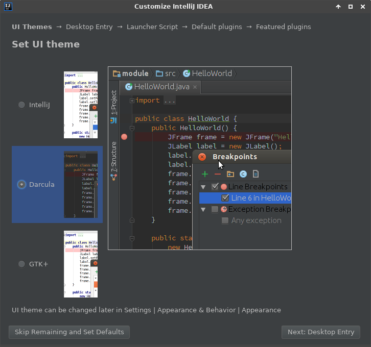
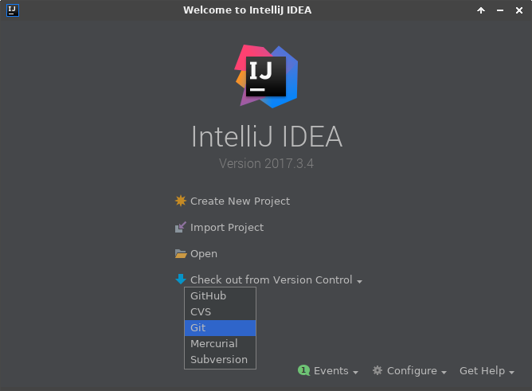

## Part 1

### Install IntelliJ

IntelliJ comes in two versions:

- **Community Edition**: Free to download and sufficient for this project (it is not a trial version that expires).
- **Ultimate Edition**: Paid version that has support for various frameworks (which we don't need).

You can find versions for Windows, Linux, and macOS on the official website.

No additional plugins are required for this project.

  * start IntelliJ

  * select **Do not import settings**
  * click **OK**

  * select Theme
  * click **Skip Remaining and Set Defaults**

  * select **Check out from Version Control**
  * select **Git**

  * enter your repository/branch details
  * click **Test**

  * click **Clone**

  * -- wait ---

You will receive a prompt indicating that your checkout from version control contained a project file.  In my experience, attempting to open this file fails to do anything useful.

  * click **No**

  * click **Open**

Browse to the folder you specified for the parent and inside the folder you specified for the git checkout.  You should see a *pom.xml* file.
  * select the *pom.xml* file
  * click **OK**

  * select **Open as Project**

At this point IntelliJ should be open with the Forge project.  However, it will take a while for IntelliJ to download all the project dependencies.  This is reflected in the bottom status bar by default.

## Part 2
  * select **File**
  * select **Project Structure...**

  * select **New**
  * select **JDK**

If necessary browse to the JDK directory.
  * click **OK**

  * click **OK**

  * select **Run** from the top menu
  * select **Debug...** from the drop down

  * select **Edit Configurations...**

  * click the **+** in the upper left

  * select "Application"

  * set the **Name** to: Forge
  * set the **Main class** to: forge.view.Main
  * Latest IntelliJ Versions: click Modify options and check Add VM Options
  * set the **VM options** to: 
    * **(JAVA 17 and above)**
      > -Xms768m -XX:+UseParallelGC -Dsun.java2d.xrender=false --add-opens java.base/java.util=ALL-UNNAMED --add-opens java.base/java.lang=ALL-UNNAMED --add-opens java.base/java.lang.reflect=ALL-UNNAMED --add-opens java.base/java.text=ALL-UNNAMED --add-opens java.desktop/java.awt.font=ALL-UNNAMED --add-opens java.base/jdk.internal.misc=ALL-UNNAMED --add-opens java.base/sun.nio.ch=ALL-UNNAMED --add-opens java.base/java.nio=ALL-UNNAMED --add-opens java.base/java.math=ALL-UNNAMED --add-opens java.base/java.util.concurrent=ALL-UNNAMED --add-opens java.desktop/java.awt=ALL-UNNAMED --add-opens java.base/java.net=ALL-UNNAMED --add-opens java.desktop/javax.swing=ALL-UNNAMED --add-opens java.desktop/java.beans=ALL-UNNAMED --add-opens java.desktop/javax.swing.border=ALL-UNNAMED -Dio.netty.tryReflectionSetAccessible=true

  * set the **Working directory** to %MODULE_WORKING_DIR%
  * set **Use classpath of module** to: forge-gui-desktop
  * click **Debug**

  * -- wait --

If all goes well, you should eventually see the Forge splash screen followed by the main UI.

### Adventure Mode debugging on Desktop

Follow the same steps to create a Run Configuration, but use forge-gui-mobile-dev instead of forge-gui-desktop as the module and directory.

  * select **Run** from the top menu
  * select **Debug...** from the drop down
  * select **Edit Configurations...**
  * click the **+** in the upper left
  * select "Application"

  * set the **Name** to: Forge
  * set the **Main class** to: forge.app.Main
  * Latest IntelliJ Versions: click Modify options and check Add VM Options
  * set the **VM options** to: 
    * **(JAVA 17 and above)**
      > -Xms768m -XX:+UseParallelGC -Dsun.java2d.xrender=false --add-opens java.base/java.util=ALL-UNNAMED --add-opens java.base/java.lang=ALL-UNNAMED --add-opens java.base/java.lang.reflect=ALL-UNNAMED --add-opens java.base/java.text=ALL-UNNAMED --add-opens java.desktop/java.awt.font=ALL-UNNAMED --add-opens java.base/jdk.internal.misc=ALL-UNNAMED --add-opens java.base/sun.nio.ch=ALL-UNNAMED --add-opens java.base/java.nio=ALL-UNNAMED --add-opens java.base/java.math=ALL-UNNAMED --add-opens java.base/java.util.concurrent=ALL-UNNAMED --add-opens java.desktop/java.awt=ALL-UNNAMED --add-opens java.base/java.net=ALL-UNNAMED --add-opens java.desktop/javax.swing=ALL-UNNAMED --add-opens java.desktop/java.beans=ALL-UNNAMED --add-opens java.desktop/javax.swing.border=ALL-UNNAMED -Dio.netty.tryReflectionSetAccessible=true

  * set the **Working directory** to %MODULE_WORKING_DIR%
  * set **Use classpath of module** to: forge-gui-mobile-dev
  * click **Debug**
