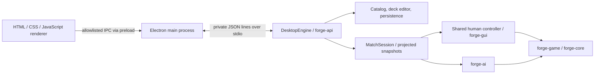

# Mana Table architecture

Mana Table adds two modules to the Forge repository: a Java adapter (`forge-api`)
and an Electron application (`forge-desktop`). Forge remains the rules authority.

## Where to change things

| Area | Entry points | Responsibility |
| --- | --- | --- |
| Desktop process | `forge-desktop/main.cjs`, `preload.cjs` | Window, permitted IPC, file dialogs, artwork cache, engine lifetime |
| Runtime/transport | `runtime.cjs`, `engine-client.cjs` | Java/path resolution, request IDs, replies, startup status, logs |
| Workshop | `renderer/app.js`, `presets.js` | Catalog, deck editing, imports, practice, preset browsing |
| Match coordination | `renderer/match.js` | Setup, scoped answers, polling, stable board rendering, prompt controls |
| Card interaction | `hand-view.js`, `table-gestures.js`, `card-preview.js`, `table-card-preview.js`, `battlefield-view.js` | Fan layout, cancelable dragging, card enlargement, optional inspector, alternate faces and crowded ranks |
| Match explanation | `turn-guide.js`, `match-feedback.js` | Phase guidance, activity history, turn indicators and animation |
| Response preferences | `preferences.cjs`, `play-preferences.js`, `response-skip.js` | Remembered Auto/Full control, own-turn stops, temporary holds and engine-authorized passes |
| Combat | `combat-view.js` | Attackers, defenders, legal block connections and assignment controls |
| Java protocol | `DesktopEngine.java` | Method dispatch, current deck, saved files, practice and one active match |
| Deck hooks | `CardCatalog`, `DeckEditor`, `DeckImport`, `DeckPresets`, `MatchSetup` | Search, revisioned edits, validation, imports, detached match decks |
| Game adapter | `MatchSession`, `MatchActivity`, `HeadlessPlatform`, `CombatCardIds` | Human input, AI session, visibility filtering, stable projected state |
| Minimal observation hooks | `GameStateMapper`, `GameObservation` | Smaller immutable projection and event invalidation for other consumers |

Deck-building discovery and review live in `deck-workshop.js` / `.css`, with
`DeckInsights.java` providing role estimates and recommendations. The script
loads before `app.js`; its callbacks use the shared app state after initialization.
`app.js` owns the edit queue. Catalog controls count by card name across printings
and reuse an existing printing in the selected destination. Deck-row quantity
and section moves preserve exact printing IDs. Moves use a single atomic edit
batch, so undo restores both sections. Queued edits capture the deck ID and source
section; review replies are checked against the deck ID, revision, and format
request key. Search/grouping filters change presentation only.

Java classes above live in `forge-api/src/main/java/forge/api`. Renderer files
are under `forge-desktop/renderer`. The API README is the detailed
[integration contract](../../forge-api/README.md).

The renderer currently uses classic scripts and shared globals, loaded in the
order listed by `renderer/index.html`. There is no bundler, framework, or module
loader. CSS is layered: base workshop/match styles, battlefield layout, then
feature-specific styles. Keep feature behavior in its owning file and document
cross-file assumptions instead of expanding the central `match.js` indefinitely.

Battlefield cards use an explicit `battlefield` presentation in `cardTile`.
`battlefield.css` reserves a square footprint around each portrait surface, which
turns a full 90 degrees when tapped. Current stats, counters and damage remain
upright. `match-feedback.js` animates that same surface only when the tap state
changes. Two battlefield ranks remain vertical at every supported size.
`battlefield-view.js` overlaps crowded ranks and provides edge buttons, wheel and
keyboard browsing; native scrollbars are hidden without removing access to cards.
`card-preview.js` delegates match roots to `table-card-preview.js`. Hand cards lift
in place; other cards use an image-only, pointer-transparent layer anchored to the
source. The optional rail inspector shows rules and current values. Both consume
only the visibility-filtered projection, including permitted alternate faces.
`hand-view.css` reserves the lower-left player controls; `hand-view.js` keeps the
fan and local gap behavior. `match-feedback.css` places the action prompt at the
lower right, with latest activity and expandable history above. Game overlays
sit above the hand and player controls while selecting combat or library cards.

## A game action, end to end

1. The engine publishes a stable, immutable snapshot for the trusted human viewer.
2. The renderer displays the current prompt and gives actionable cards that
   prompt's handles. It retains DOM nodes across status-only updates.
3. A click/drag records its source element, session, and prompt before submitting.
4. The host validates those IDs and the answer, then dispatches to the existing
   human controller. Synchronous dialogs complete a response future directly.
5. The engine resolves the action. The renderer acknowledges immediately and
   polls for the next stable state; animation never delays or submits input.

`match.js` prevents overlapping polls and ignores results from superseded
sessions. Polling is faster while resolving than while waiting for input.
Required selections keep the engine's message and enabled actions; explanatory
turn guidance never chooses an action on the player's behalf.

In **Auto**, `response-skip.js` submits `passIfNoResponse` only for
`InputPassPriority` with engine-issued `canAutoPass: true`.
This permission comes from the controller's current action scan and preserves
empty-stack main phases and required inputs. The normal session/prompt checks
still apply. Switching to **Full control**, selecting an own-turn stop, or using
**Hold this turn** cancels a queued pass. Only the temporary hold resets at a
turn/session boundary. Browsing the workshop suspends automatic passes.
`preferences.cjs` validates and atomically stores the response mode, phase stops
and inspector preference in the fixed profile file `preferences.json` through
dedicated, origin-checked IPC. Auto is the production default; the renderer uses
Full control until loading finishes. Failed saves preserve the latest local
choice instead of re-enabling automatic play. Tests seed Full control unless
they explicitly exercise Auto. Packaging preserves this file across betas.

## Identifiers with different jobs

| Value | Use | Lifetime |
| --- | --- | --- |
| Catalog printing `id` | Deck entries and printing lookup | Supplied catalog; opaque and case sensitive |
| Deck `revision` | Reject stale edits and setup previews | Current deck editor; monotonically increases |
| Match `id` / action `sessionId` | Bind an answer to the active game | One session |
| Prompt `id` / action `promptId` | Bind an answer to the pending decision | One prompt |
| Card `key` | Select an engine-authorized card for that decision | One prompt; never reuse it |
| Card `visualId` | Correlate visible cards for presentation | Session visibility; not an action capability |
| Card `combatId` | Correlate combat positions, including redacted face-down cards | Visible combat position; not a rules identity |
| `revision` / `boardRevision` | Refresh status versus the last stable board | One session |
| Activity event `id` | Deduplicate displayed history | One session; not a replay or save cursor |

Hidden zones publish counts, not identities or ordered placeholders. Library
searches expose only the engine's temporary selection/reveal set. Face-down
objects and alternate faces must follow the adapter's visibility rules. Do not
serialize live Forge objects, raw logs, or mutable views directly to the renderer.

## Extending the app

**New visual component:** add its script/styles to `renderer/index.html` and the
static resource allowlist in `main.cjs`. Reuse projected state and the existing
answer path. Check keyboard operation, minimum window size, and reduced motion.

**New engine command:** add dispatch/validation in `DesktopEngine`, allowlist it
in `main.cjs`, document it in the API contract, and exercise it through the real
pipe transport. `preload.cjs` intentionally exposes a small bridge, not Node APIs.

**New match state:** copy data at stable engine/controller boundaries inside
`MatchSession`; do not read live views from the transport or renderer threads.
Check both authorized visibility and absence of hidden details.

**New host module:** update the explicit file list in `scripts/package.cjs` and
verify a packaged smoke test. A source-tree run alone will not detect a missing
file in the package.

## Upstream boundary and current limits

Card scripts live in `forge-gui/res`; core rules and AI stay in their existing
modules. The adapter reuses the shared human controller without starting Swing
or LibGDX. Existing integration touchpoints include event unsubscription,
explicit resource/profile paths, and reusing initialized `StaticData` through
`FModel.getMagicDb`. Keep further shared changes small and reviewable.

This is a local, single-human application with one active match. There is no
network API, multiplayer service, durable match resume, or full tournament-format
legality service. The engine's own GUI modules and network features are separate
from Mana Table's UI. Packaging is currently Windows x64 only.
