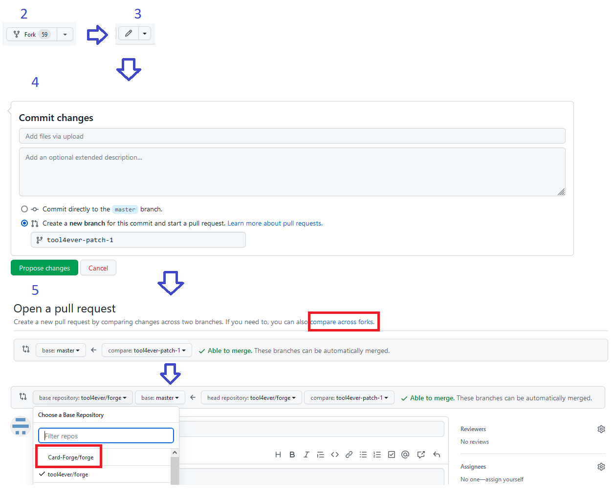

This is a list of basic troubleshooting questions that come up for most new players, before jumping to the Discord about your issue, please review this document for some of the more common issues.

* Check the FAQ in Discord (probably more up-to-date if things break unexpectedly on us)
https://discord.com/channels/267367946135928833/1095026912927154176

* Search the help posts in Discord
https://discord.com/channels/267367946135928833/1047001034788196452

# General

## How do I download content?

Forge has content downloaders within the app itself, you can use those tools to update the graphics assets. More information about card and token image assets can be found here. [Card Images, Downloading](Card-Images.md#downloading)

## My desktop match/deck view is all messed up?
The match and deck editor windows contain panels that can be moved and/or resized. The changes that you make are saved to files that are named "editor.xml" and "match.xml". These files can be found in your userDir/preferences/ directory.

Sometimes people will decide that they do not like the changes that they made and wish to go back to the original layout. To reset layouts to default, go to the Game Settings -> Preferences -> Troubleshooting section. You will find at this location two buttons that will reset the match layout and the deck editor layouts.

Also use the mentioned measure if your match or deckeditor won't start - it would help in 90% of the cases.

## I think I found a bug in Forge. What do I do?

*Most users, who are running beta versions of Forge, should continue to use these instructions. As for alpha testers, these instructions have yet to be made congruent with the latest automatic bug reporting from within Forge.*

Bug reports from users are the lifeblood of Forge. Please keep in mind that "beta" releases *are* test releases. Forge is constantly evolving, so we do not yet have "stable" or "production" releases. Because of the pace at which new cards are added to the multiverse by external forces, this will be the  norm for some time. We do not expect everything to work 100%. We have a small number of developers and a handful of slightly less technical people actively improving the game. We simply cannot devote the resources to test every single card, much less the nearly infinite ways the cards can interact.

For starters, please take note of (1) what you had in play, (2) what your opponent had in play and (3) what you were doing when the error occurred. If you get a Crash Report from inside Forge, please save the data to a file. This information is very important when reporting a problem. Don't worry if you didn't think of that right away, until your next start, the "Forge.log" in the game directory will also provide that information.

If you did not get a Crash Report, but you have experienced a problem in how Forge handled one or more cards or game rules, *please read the cards (and the Oracle rulings) carefully* to make sure you understand how they work. You may be surprised to find that Forge is actually enforcing the rules correctly.

Because duplicate bug reports use up our limited resources, please research your bug with the **Search** box on Forge's [issue tracker](https://github.com/Card-Forge/forge/issues) to see if your bug has already been reported there. For Crash Reports, use key words from the second paragraph of the Crash Report.

* If you find a matching issue, examine it to see if you have anything new to contribute. For example, a different way of reproducing a problem can sometimes be helpful. If the issue was posted to the forum, you may post your additional information there.

* If you find nothing, please try to reproduce the problem and take notes. If we can use your notes to reproduce the bug for ourselves, it is *much* easier to fix!

* If you're unsure, you can also post on one of the support channels of the discord. In case you do not get a timely response, please submit a new issue anyway to make sure it doesn't get lost.

## I have an idea to make Forge better. What do I do?

Follow the directions in [Bug Reports](Frequently-Asked-Questions#i-think-i-found-a-bug-in-forge-what-do-i-do), keeping in mind that you are not reporting a bug, but rather a **Feature Request**.

# Development

## I want to help develop Forge. How do I get started?

Forge is written in Java, so knowledge in that language (or similar Object Oriented languages like C++ or C\#) is very helpful. However, it is possible to learn the grammar for writing the data objects of cards without programming experience.

A development environment such as [IntelliJ](https://www.jetbrains.com/idea) is beneficial, as it helps writing, compiling and testing your changes.

Thanks to the nature of how cards are implemented, you can also contribute these as small plain text files. This is especially helpful during a preview season, when there are a lot of new cards in the backlog. This is mostly coordinated in #card-scripting on the Discord (and the pins there).

For smaller first-time contributions using the GitHub web interface is also an alternative:

1. Register GitHub Account (if you don't already have one)
2. Make your own fork of Forge, press this button on the main project page (must only be done first time)
3. In your fork you can navigate to `forge-gui/res/cardsfolder/upcoming` and either Upload new files or open an existing one
4. When you're done at the bottom make sure to create a new branch, that makes it easier to keep your changes apart
5. On the next page make sure you choose the original project as merge target (see screens)
6. Please test your scripts and watch for review comments

To obtain the source code of Forge, read our [Development Guide](Development/IntelliJ-setup/IntelliJ-setup.md).

## My system is all setup to help. What now?

Take a look through the /res/cardsfolder folder. This is where all the card data lives. If you know of cards that are missing from Forge, see if there are similar cards that already exist.

# Gameplay

## Where do I use Flashback or a similar ability that is in an External area?

Click on the Lightning Bolt icon in the player panel. Since cards with external Activations aren't as clear to activate, we created this shortcut for this specific purpose. After the last card is removed from a zone window, that window will automatically be hidden.

## How do I target a player?

Just click on the player's Avatar in the Player Panel when prompted to select a Player as a target.

## Where did my mana go?

If you have an effect that generated you some mana, and you don't know where it is. Check out the Player Panel. There are 6 different mana subpools one for each color/colorless that should have it. If you accidentally tapped your mana before your Main Phase, your mana is gone. Sorry, we don't have a way at this time to revert these actions. In general, I'd say it's easier/better to start casting a spell first, then activate your mana so this doesn't happen.

# Quest Mode

## What is the difference between Fantasy Quest and Normal Quest?

In Normal Quest, you start with 20 life and only have access to the Card Shop. In Fantasy Quest, you start at 15 life and gain additional access to the Bazaar which allows you to buy things like extra life points, Pets, Plants and more.
