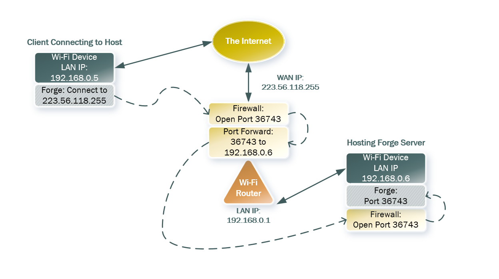

# Chapters
- [Status & Support](#status--support)
- [Requirements](#requirements)
- [Quick Start](#quick-start)
- [Reconnect Support](#reconnect-support)
- [Network Configuration](#network-configuration)
  - [Local Network Setup](#local-network-setup)
  - [Remote Network Setup](#remote-network-setup)
  - [VPN / Software-Defined Networks](#vpn--software-defined-networks)
- [Known Limitations](#known-limitations)
---

# Status & Support

> [!CAUTION]
> **Network play is a work-in-progress.** You will encounter bugs. When they appear, they will likely be mid-game and require restarting both the client and host. Please report bugs and issues to help improve stability.

Cross-platform play is supported.  
There is no built-in matchmaking. Network play is designed for playing against people you know and manually sharing connection details.

> [!TIP]
> The **[Forge Discord](https://discord.gg/nsAhGwD)** has a dedicated network play channel. You can use it to find opponents and folks there will be happy to help you with any issues!
---

# Requirements

| Requirement | Details |
|---|---|
| **Players** | Up to **8 players** per game (1 host + up to 7 remote players) |
| **Roles** | **Host** runs Forge as the server; **Client** connects to it |
| **Game Types** | **Constructed** formats only (no Draft or Sealed). Supported variants: Commander, Oathbreaker, Tiny Leaders, Brawl, Archenemy, Planechase, Vanguard. |
| **Network** | Local (same Wi-Fi, Wi-Fi Direct, Ethernet) or Remote (IPv4 internet) |
| **Port** | Default: **36743** (TCP). Can be changed in Forge's network preferences. |
| **Firewall** | Host must allow Forge or the server port through its firewall. Do **not** disable the firewall entirely. |
| **Port Forward** | Required for remote play — forward the server port on the host's router, or use UPnP (see below) |
| **IP Version** | IPv4 required. IPv6 with full Dual Stack works; Dual Stack Lite does **not**. |

---

# Quick Start

1. **Configure network** — Host must configure network settings to enable external connections (see [Network Configuration](#network-configuration) below).
2. **Verify versions** — Confirm all devices are running the same Forge version (see [Version Compatibility](#version-compatibility) below).
3. **Launch Forge** on all devices.
     - Mobile: Choose "Classic Mode", then "Play Online"
     - Desktop: "Online Multiplayer" > "Lobby" > "Connect to Server"
4. **Host** leaves the server address field **empty** and clicks OK.
     - On first host, Forge will ask whether to **automatically open the port via UPnP** (see [UPnP](#upnp-automatic-port-forwarding) below). If your router supports UPnP, choosing "Just Once" or "Always" can skip manual port forwarding entirely.
5. **Host** determines address to share with clients:
     - **Local play:** Use the **Copy Server URL** button in the lobby — this copies the address in the correct format. Forge displays the host's IP (typically `192.168.x.x`). Verify against the device's network settings. Ignore any suggestion to use `localhost`.
     - **Remote play:** Verify the host's external IP at [canyouseeme.org](http://canyouseeme.org).
 7. **Client** enters the host's address in the connection dialog and clicks OK.
     - The address format is **`IP:port`** — for example: `192.168.1.50:36743` (local) or `203.0.113.45:36743` (remote).
     - If the port is omitted, Forge defaults to 36743.
8. **Configure the match:**
     - Host selects match type, teams, and game settings.
     - All players select decks, sleeves, and avatars.
     - Each player toggles their **Ready** switch.
9. **Host starts the match** once all players are ready.

---

# Reconnect Support

> [!IMPORTANT]
> **The host's device is the server.** If the host disconnects or closes Forge, the game ends immediately for all players — there is no host migration or disconnect support for server crashes. Choose the most stable device/connection as the host.

If a client player disconnects during an active game, the server enters **reconnection mode** instead of immediately ending the match.

## What happens on Disconnect

- The game **pauses** for the disconnected player — all other players see a notification.
- A **5-minute countdown** begins, with status messages broadcast every 30 seconds.
- The disconnected player can rejoin by reconnecting to the same server with the **same username**.
- On successful reconnect, the full game state is re-sent to the player and the game resumes normally.

## If the Player doesn't Reconnect

When the 5-minute timeout expires, the disconnected player is **replaced by an AI** and the game continues.

## Host Commands

The host can type these commands in the lobby chat during the reconnection window. These commands are **host-only** — clients cannot use them.

| Command | Effect |
|---|---|
| `/skipreconnect [player]` | Immediately replace the disconnected player with AI (skip the countdown). Player name can be omitted if only one player is disconnected. |
| `/skiptimeout [player]` | Cancel the countdown timer and wait **indefinitely** for the player to reconnect. |

---

# Network Configuration

> [!IMPORTANT]
> Complete the **Local Network Setup** first, even if your goal is remote play. Remote setup builds on a working local configuration.

## Local Network Setup

### 1. Configure the Host Firewall

| Platform | Action |
|---|---|
| **Android** | No configuration needed. |
| **Windows** | Allow Forge (or port 36743) through Windows Defender Firewall. |
| **macOS** | Allow incoming connections for Forge in System Settings > Firewall. |
| **Linux** | Allow port 36743 through your firewall (e.g., `ufw allow 36743/tcp`). |

### 2. Validate the Port is Open

Test from a **different device** on the same network to confirm the host is accepting connections on port 36743.

- **Android:** Use [PortDroid](https://play.google.com/store/apps/details?id=com.stealthcopter.portdroid) — scan the host's internal IP for port 36743.
- **Windows (PowerShell):** Open PowerShell and run:
  ```powershell
  Test-NetConnection -ComputerName <HOST_IP> -Port 36743
  ```
  Success: `TcpTestSucceeded : True`. Failure: `TcpTestSucceeded : False`.
- **macOS / Linux:** Use netcat:
  ```bash
  nc -vz <HOST_IP> 36743
  ```
  Success: "Connection to ... succeeded". Failure: "Connection refused" or timeout.

Once validated, provide the host's internal IP and port to the client (e.g., `192.168.1.50:36743`).

## Remote Network Setup

### UPnP (Automatic Port Forwarding)

Forge has built-in **UPnP** support that can automatically configure your router's port forwarding. When you host a server, Forge will prompt:

> "Attempt to open port 36743 automatically?"

| Option | Behavior |
|---|---|
| **Just Once** | Attempt UPnP for this session only. You will be prompted again next time. |
| **Always** | Always attempt UPnP when hosting. Saved as a preference. |
| **Not Now** | Skip UPnP this time. You will be prompted again next time. |
| **Never** | Never attempt UPnP. Saved as a preference. You will need to configure port forwarding manually. |

**If UPnP succeeds**, no manual router configuration is needed — skip to [Validate External Access](#2-validate-external-access) below.

**If UPnP fails**, Forge will notify you that the port could not be opened automatically. You will need to configure port forwarding manually using the steps below. Common reasons for failure: UPnP is disabled on the router, the router doesn't support UPnP, or a firewall is blocking UPnP discovery.

### 1. Manual Port Forwarding on the Router

Access your router's admin interface (typically `http://192.168.x.1/`, where `x` matches your local IP subnet). Navigate to port forwarding settings (may be under "Advanced") and create a rule:

| Field | Value |
|---|---|
| External/Remote IP | Blank or "Any" |
| External Port | 36743 |
| Internal IP | Host machine's local IP |
| Internal Port | 36743 |

Router-specific guides: [portforward.com/router.htm](https://portforward.com/router.htm) (use the guides only — their software isn't recommended).

### 2. Validate External Access

- Go to [canyouseeme.org](http://canyouseeme.org) **from the host machine** while Forge is hosting.
- Enter port **36743** and click "Check Port".
- A **Success** message confirms the configuration is correct.

Share the external IP shown on that page with the client. Remember the client needs to enter it as **`IP:36743`** (e.g., `203.0.113.45:36743`).

Here's how a typical network topology might look, when playing through Firewall and Port Forwarding:


## VPN / Software-Defined Networks

If you cannot configure port forwarding — for example on a cellular connection, public Wi-Fi hotspot, or a network you don't control — you can use a **Virtual Private Network (VPN)** or **Software-Defined Network (SDN)** to create a private network between players.

> [!CAUTION]
> Forge cannot provide support for third-party VPN or SDN software. Refer to each provider's documentation for setup help.

### How It Works

A VPN or SDN creates a virtual local network between devices over the internet. Once connected, all players appear to be on the same LAN — so you can follow the **[Local Network Setup](#local-network-setup)** steps instead of dealing with port forwarding.

### Recommended Options

| Tool | Type | Cost | Notes |
|---|---|---|---|
| [ZeroTier](https://www.zerotier.com/download/) | SDN | Free (personal use) | Easiest setup. Create a network, share the network ID, approve joiners. No server needed. |
| [RadminVPN](https://www.radmin-vpn.com/) | VPN | Free | Simple LAN-style VPN. Install on both devices and join the same network. |
| [Hamachi](https://www.vpn.net/) | VPN | Free (up to 5 devices) | Established option, but requires a LogMeIn account. |

For self-hosted options (e.g. OpenVPN on your own server or router), you will need control of a network or a rented server with a public IP. Both players install the VPN client and connect to that server. This adds complexity but gives full control.

### Quick Setup (ZeroTier Example)

1. All players install [ZeroTier](https://www.zerotier.com/download/).
2. One player creates a network at [my.zerotier.com](https://my.zerotier.com) and shares the **Network ID**.
3. All other players join using that Network ID.
4. The network creator approves each device in the ZeroTier web console.
5. Once connected, follow the **[Local Network Setup](#local-network-setup)** — use the ZeroTier-assigned IP addresses instead of your normal LAN IPs.

### Security Note

Any player on a shared private network can see other devices on that network. Only share access with people you trust, and disconnect when you're not playing.

---

# Known limitations

## "Disconnected From Lobby"
A common cause for this is that the client and server resource (res) folder content differs. This can be verified by checking the game log and looking for an IOException referring to a "Card ... not found".

Forge automatically warns in the lobby chat when a client's version differs from the host's but **does not block the connection**. While network play between different versions of Forge can be possible, mismatched versions may cause desync or crashes mid-game. If possible always use the same version on all devices to avoid network compatibility issues.

## Lag / High Bandwidth
Network play currently lacks traffic optimization. A single game can transfer hundreds of megabytes. Slow connections will experience significant lag.
