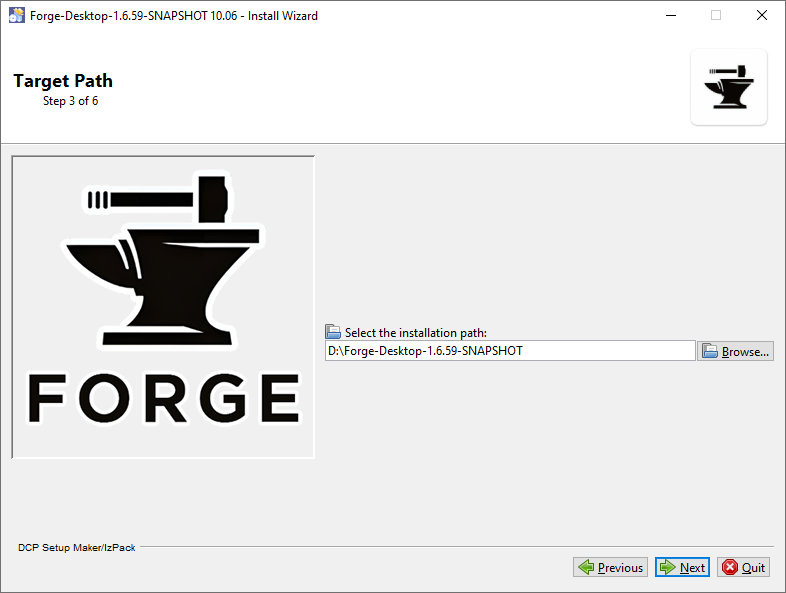

# Downloads

## Snapshots
* Snapshots are automated daily builds of the source code.
* They contain the latest bug fixes, features and cards.
* If the snapshot isn't in the location below, it's because its in the middle of uploading a new snapshot - come back later to grab it.

[***CLICK HERE FOR DOWNLOAD LINKS - Forge SNAPSHOT Version (DESKTOP/ANDROID)***](https://github.com/Card-Forge/forge/releases/tag/daily-snapshots)

* For desktop, grab the installer file that ends in .jar
* For android, grab the android file that ends in .apk
  &dash; Watch the screen recording if one of following steps isn't clear for you

<https://github.com/user-attachments/assets/7a0c7bb8-7cf9-4800-8091-bcc30ff2f4d8>

## Releases
* "Releases" are really intended where "99% cards implemented are working and stable".
* **They are NOT bug-free.** They are not updated after they're built, meaning you need to wait for the next release if you encounter a bug, or use the SNAPSHOT version instead.
* If you are looking for newly spoiled cards as soon as possible, grab the SNAPSHOT version instead.
* The current release mechanism is failing unexpectedly for Android. So just stick with snapshots for Android users.

[***CLICK HERE FOR DOWNLOAD LINKS - RELEASE DESKTOP***](https://github.com/Card-Forge/forge/releases/latest)

* Grab the installer file that ends in .jar

# System Requirements
**Forge Requires Java** to run, please make sure you have Java installed on your machine prior to attempting to run.

* **Java 17** is required as minimum version and can be acquired through the Standard Edition Development Kit (JDK) or the OpenJDK. Continued development provides new features in those editions, therefore you need the Java Development Kit to have those newer editions:
  * Download - [https://jdk.java.net/](https://jdk.java.net/)
  * Source Code - [https://github.com/openjdk/jdk/](https://github.com/openjdk/jdk/)

Most people who have problems setting up Forge, do not have Java setup properly. If you are having trouble, open your terminal/command line and run `java --version`. That number should be 17 or higher.

The memory requirements for Forge have fluctuated over time. The default
setting on your computer for the Java heap space may not be enough to
prevent the above problems. If you launch Forge by double-clicking the
jar files directly you could eventually receive a **java heap space
error**.

We have created several scripts that will launch Forge with a greater
allotment of system resources. (We do this by passing `-Xmx1024m` as
an argument to the Java VM.)

If you plan to eventually download all card images make sure you have several gigabytes of free drive space.

# Install and Run
> Warning: Do **NOT** overwrite an existing installation. Always unpack/install the package in a new folder to avoid problems!

## Install Wizard (jar)
* Run/Double click "**forge-installer**-VERSION.jar" where VERSION is the current release version and click next until the Target Path window appears. If double clicking the .jar file doesn't load the main interface you can run it via terminal/command line `java -jar FILENAME.jar` where FILENAME is the name of the installer.

* Browse to your preferred install directory and click next until installation starts.

**If you're on Windows and not running the installer as administrator, you probably won't be able to install to the program files directories.**

* After the installation finishes, close the installer. Run the executable forge|forge-adventure (.exe/.sh/.cmd)

### What if double-clicking doesn’t work?
Sometimes double-clicking will open the jar file in a different program.
In Windows, you may need to right-click and open the properties to change the launching program to Java.
This might be different in OSX or Linux systems (file permission related).

## Manual Extraction (tar.bz2)

### Desktop Windows
* Unpack "forge...*tar.bz2*" with any unpacking/unzipping app (e.g. 7-zip, winrar, etc)
  * You'll end up with "forge...*tar*".
* Unpack that ".tar" file once more into its own folder.
* Run Forge app/exe

### Desktop Linux/Mac
* Unpack "forge...*tar.bz2*" with any unpacking app. (Check your package repository, or app store.)
  * You'll probably end up with just a folder, and fully extracted.
  * If you do end up with a ".tar" file, unpack that file also into its own folder.
* Run Forge script:
  * Linux: Run the ".sh" file in a terminal (double clicking might work.)
  * MacOS/OSX: Run the ".command" file by double clicking in Finder, or run from the terminal.
    * If the command file doesn't appear to do anything, you'll need to [modify the permissions to be executable.](https://support.apple.com/guide/terminal/make-a-file-executable-apdd100908f-06b3-4e63-8a87-32e71241bab4/mac) (This is a temporary bug in the build process.)
    * Additionally OSX needs to have a JRE AND a JDK installed because reasons.

### Android
* Sideload/Install "forge...apk"
* Run Forge

# User data migration
There are three defined user data directories: userDir, cacheDir, and cardPicsDir, and their locations depend on the standard paths for your operating system:

    Windows:
        userDir=%APPDATA%/Forge/
        cacheDir=%LOCALAPPDATA%/Forge/Cache/ (or %APPDATA%/Forge/Cache/ for Windows versions before the local/roaming directory split)
    OSX:
        userDir=$HOME/Library/Application Support/Forge/
        cacheDir=$HOME/Library/Caches/Forge/
    Linux:
        userDir=$HOME/.forge/
        cacheDir=$HOME/.cache/forge/

The appdata directory is hidden by default in Windows 7 and above versions. Open a Windows Explorer window (or double-click on My Computer) and in the address field type "%appdata%/forge/" (without the quotes).

cardPicsDir is defined as <cacheDir>/pics/cards/ by default.  If you wish to use a non-default directory, please see the forge.profile.properties.example file located in the Forge installation directory root.  You can use this file to, for example, share the card pics directory with another program, such as Magic Workstation.

If you are using the Mac OS X version of Forge then you will find the forge.profile.properties.example file by right clicking or control clicking on the Forge.app icon. Select "Show Package Contents" from the contextual menu. A Finder window will open and will display a folder named Contents. Navigate to the folder:
/Contents/Resources/Java/
and you will find the file.

The userDir's location may be changed by setting the environment variable "FORGE_USER_DIR" to the desired path. Likewise, the cache dir can be changed using the
"FORGE_CACHE_DIR" environment variable.

## Import Data
If you have a directory full of deck files, you can use the Import Data dialog to copy or move them to the appropriate directory. The dialog gives you a full listing of all file copy/move operations, so you can see what will happen before you click 'Start Import'.

# Accessibility
We know some people are colorblind and may not be able to differentiate between colors of the default theme. Forge does have access to other [Skins](Skins.md), which use other color palettes that might be more suitable for you.

# Play Adventure Mode on Desktop
* Run the Adventure Mode EXE or Script in the Folder you extracted.
* The game will start with an option for Adventure or Classic Mobile UI.
* Android/Mobile builds are built as the Adventure Mode or Mobile UI and nothing special is needed.
  * If adventure mode option does not show up;
    * check you're up to date with your version.
    * check in the settings that the "Selector Mode" is set to `Default`

# Gameplay

## Targeting Arrows
When hovering over items on the stack, arrows will be displayed between that item and all of its targets (both cards and players).
The arrow will be red if the spell/ability's activator is an opponent of the target or its controller, and blue if targeting an ally of the target or its controller.

## Card Zoomer
You can gaze at your HQ images in all their glory with just a flick of the mousewheel, holding the middle mouse button down, or holding the left and right mouse buttons down at the same time. This feature will also increase the size of low quality pics up to the size used for high quality pics, but the image will not be very clear.

Instructions:
- Works on any card image in the Deck Editor or Duel screen.
- Move your mouse over the card you want to zoom and mouse-wheel forward.
- Mouse-wheel back, mouse click or pressing ESC closes the zoomed image.

Split cards (name contains "//") are rotated 90 degrees for easier viewing.

If a card is a flip or double-sided card then you can easily view the alternate image using flick wheel forward or tap CTRL key.

The standard flip graphic (the two rotated arrows) is displayed if the card can be flipped or transformed.

Forge supports showing XLHQ (extra large high quality) card pictures when zooming in on a card if these pictures are available. Forge will look for XLHQ card art in the "XLHQ" subfolder of the "pics/cards" folder in Forge cache. XLHQ pictures should have the ".xlhq.jpg" extension instead of the ".full.jpg" one (CCGHQ XLHQ releases comply with this naming scheme).  
Please note that XLHQ versions of cards are *only* showed in the zoom view, regular card pictures are still used (LQ/HQ, depending on what you're using) on the battlefield and elsewhere in the game because XLHQ art is significantly more taxing in memory consumption  (and in addition to that, XLHQ card borders are not cropped the way Forge expects them in order to show them properly on the battlefield anyway).

XLHQ tokens are also supported, but the naming scheme for them is a little different - they are looked up in "pics/tokens/XLHQ" and have their ordinary names.

## Easier creature type selection
When prompted to select a creature type for a card like *Obelisk of Urd*, creature types present in your deck will appear on top, sorted from most to least frequent, followed by all other creature types.  
This should make it so, more often than not, you can just accept the dialog without searching.

## Auto-Target
When playing spells and abilities with the text "target opponent", if you only have one opponent, you will no longer be asked to choose the opponent to target.  
When triggered abilities have only one valid target, that target will now be auto-selected.

## Auto-Pay
When paying mana costs, you can press Enter/Spacebar or click the Auto button in the Prompt to automatically pay the mana cost using available mana sources if possible.
- The button will be disabled if you cannot pay the mana cost at that time, in which case Enter/Spacebar will cancel the spell/ability instead.
- Uses the same logic the AI uses to pay mana costs. This means it will try to use mana in your pool before mana sources in play, using colorless mana to pay the colorless part of the cost if any is available.
- You can still manually pay the cost by clicking mana sources in play (e.g. lands) or clicking symbols in your mana pool, which might be a good idea if you want to save specific mana sources for a later play that turn.
- you'll still be prompted when paying Sunburst or cards that care what colors are spent to cast it (ex. Firespout).

## Auto-Yield
- When a spell or an ability appears on the stack and it says "(OPTIONAL)" you can right-click it to decide if you want to always accept or to decline it.

  It is possible to specify the granularity level for auto-yields: the difference is that, for example, when choosing per ability if you auto-yield to Hellrider's triggered ability once, all triggers from other Hellrider cards will be automatically yielded to as well. When choosing per card, you will need to auto-yield to each Hellrider separately.

  Note that in when auto-yielding per ability, yields will NOT be automatically cleared between games in a match, which should speed the game up. When auto-yielding per card, yields WILL be automatically cleared between games because they are dependent on card IDs which change from game to game, thus you will need to auto-yield to each card again in each game of the match.

- Pressing "End Turn" skips your attack phase and doesn't get cancelled automatically if a spell or ability is put on the stack. You'll still be given a chance to declare blockers if your opponent attacks, but after that the rest of your opponent's turn will then progress without you receiving priority.

  To alleviate pressing this accidentally, as long as you're passing this way, you'll be able to press Escape or the Cancel button to be given the chance to act again. Phases with stops and spells/abilities resolving will be given a slight delay to allow you to see what's going on.

## Shift Key helper
* When you mouse over a flip, transform or Morph (controlled by you) card in battlefield, hold SHIFT to see other state of that card at the side panel that displays card picture and details.
* Hold SHIFT when clicking on mana pool icons to use as much of that mana type as possible towards the cost.
* Tap all lands in a stack using Shift+click on any in the stack.
* Attack with all creatures in a stack using Shift+click on any in the stack.

## Full Control
Right click/long tap on your player avatar:  
This feature lets you skip different helpers that streamline gameplay by avoiding somewhat annoying GUI interactions and instead use AI logic to make reasonable decisions for beginners. Useful for certain corner cases or if you want to challenge yourself with the Comprehensive Rules:  
e.g. the opposite cost order is needed if activating an animated "Halo Fountain" that's also tapped.

## Repeatable Sequences (Macros)
A feature for advanced users: during a match, you can use the default shortcut shift-R to specify a sequence of actions (mouse clicks, essentially, in the desktop paradigm). Type the IDs of cards/players you'd like to interact with, in order. Then the default shortcut @ (shift-2) will execute your sequence, one "click" at a time, repeating when it reaches the end. This is useful for executing repeated combos, such as sacrificing a recurring creature to Goblin Bombardment. You can see the IDs of cards by turning them on under "Card Overlays" in the "Game" menu.

The macro will dutifully execute your click sequence without regard to changes in game state (so if an opponent kills your specified creature mid-macro, and you continue to execute it, you will be essentially clicking on the creature in the graveyard, which may or may not be what you want).