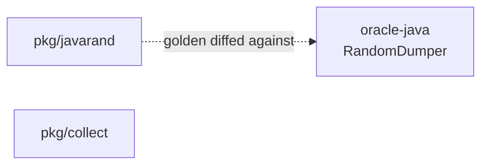

# Module Map

- **Status:** Active
- **Describes:** state as of 2026-09-07

Every Go package under `crucible/` gets a row here in the same commit that creates it (DOC-12). `crucible/tools/docgate`
will fail the build on a package with no row — not built yet, so today this is maintained by review.

Column meaning:

- **Package** — import path under `crucible/`.
- **Responsibility** — one line. If it needs two, the package is doing two things.
- **Java provenance** — the source it reproduces, or `—` for new code.
- **Port log** — note under [`../porting/port-log/`](../porting/port-log/README.md), required for ported units (PORT-4).

## Packages

| Package                                          | Responsibility                                                                      | Java provenance                                                   | Port log                                                 |
| ------------------------------------------------ | ----------------------------------------------------------------------------------- | ----------------------------------------------------------------- | -------------------------------------------------------- |
| [`pkg/collect`](../../../crucible/pkg/collect)   | Insertion-ordered set, because iteration order is load-bearing for trigger ordering | Guava-backed `FCollection`, used throughout `forge-game`          | — new code, not a line port                              |
| [`pkg/javarand`](../../../crucible/pkg/javarand) | Bit-exact `java.util.Random`, for differential testing only                         | `java.util.Random`, `Collections.shuffle`, `MyRandom.percentTrue` | — algorithm is specified by javadoc, not read from Forge |

**Two packages, both in `pkg/`.** That is deliberate and temporary: `pkg/` is reserved for code with no Crucible
semantics ([ADR-0003](../adr/0003-go-project-layout.md)), and these two qualify — an ordered set and a generator port.
Everything that follows goes in `internal/`.

## Not Go, but built here

| Path                                            | Purpose                                                                                                                                                                            |
| ----------------------------------------------- | ---------------------------------------------------------------------------------------------------------------------------------------------------------------------------------- |
| [`oracle-java/`](../../../crucible/oracle-java) | Differential-testing oracle. Standalone Maven module, JDK-only today. Never shipped, never on Crucible's execution path ([ADR-0010](../adr/0010-differential-testing-strategy.md)) |

## What the arrows look like today

Nothing imports anything. Both packages are leaves with no internal dependencies, which is what `pkg/` means.

The one-way arrow into `internal/engine` that [ADR-0003](../adr/0003-go-project-layout.md) describes does not exist yet,
because `internal/` does not exist yet. It starts at M2 with `internal/carddb`.

## Planned, not built

Listed so the gap between this map and [ADR-0003](../adr/0003-go-project-layout.md)'s layout is visible rather than
inferred. Each lands with its milestone (ARCH-2).

| Package                                                     | Milestone      |
| ----------------------------------------------------------- | -------------- |
| `internal/mana`, `internal/cardtype`                        | M1 — remainder |
| `internal/carddb`, `internal/carddb/compile`                | M2, M3         |
| `internal/engine` — the single recursive core               | M4, M5         |
| `internal/engine/effect`, `internal/valid`, `internal/expr` | M6             |
| `internal/ai`                                               | M7             |
| `internal/sim`, `internal/telemetry`, `internal/store`      | M8             |
| `internal/report`, `cmd/crucible`                           | M9             |

## Invalidated by

- Any new package under `crucible/` — the row is required in the same commit
- The first `internal/` package, which makes the "nothing imports anything" statement wrong
- `tools/docgate` being built, which turns the DOC-12 rule from review-enforced into build-enforced
