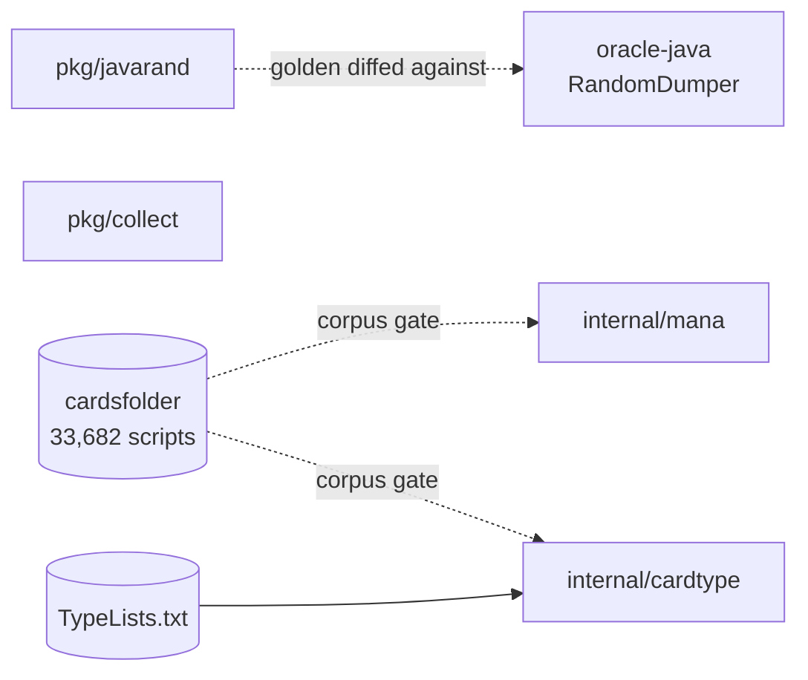

# Module Map

- **Status:** Active
- **Describes:** state as of 2026-09-08

Every Go package under `crucible/` gets a row here in the same commit that creates it (DOC-12).
[`crucible/tools/docgate`](../../../crucible/tools/docgate) fails the build on a package with no row, on a row pointing
at a directory that does not exist, and on a ported package whose row links to no port-log note.

Column meaning:

- **Package** — import path under `crucible/`.
- **Responsibility** — one line. If it needs two, the package is doing two things.
- **Java provenance** — the source it reproduces, or `—` for new code.
- **Port log** — note under [`../porting/port-log/`](../porting/port-log/README.md), required for ported units (PORT-4).

## Packages

| Package                                                    | Responsibility                                                                      | Java provenance                                                                         | Port log                                                 |
| ---------------------------------------------------------- | ----------------------------------------------------------------------------------- | --------------------------------------------------------------------------------------- | -------------------------------------------------------- |
| [`pkg/collect`](../../../crucible/pkg/collect)             | Insertion-ordered set, because iteration order is load-bearing for trigger ordering | Guava-backed `FCollection`, used throughout `forge-game`                                | — new code, not a line port                              |
| [`pkg/javarand`](../../../crucible/pkg/javarand)           | Bit-exact `java.util.Random`, for differential testing only                         | `java.util.Random`, `Collections.shuffle`, `MyRandom.percentTrue`                       | — algorithm is specified by javadoc, not read from Forge |
| [`internal/mana`](../../../crucible/internal/mana)         | Mana costs: colours, shards, and the `ManaCost` line every card script carries      | `forge.card.mana.ManaCost`, `ManaCostShard`, `ManaCostParser`, `ManaAtom`, `MagicColor` | [`mana-cost.md`](../porting/port-log/mana-cost.md)       |
| [`internal/cardtype`](../../../crucible/internal/cardtype) | Type lines, and the subtype vocabulary they are checked against                     | `forge.card.CardType`, its `Helper.parseTypes`, and `FModel.loadDynamicGamedata`        | [`card-type.md`](../porting/port-log/card-type.md)       |
| [`tools/covergate`](../../../crucible/tools/covergate)     | Fails the build on a package below the coverage floor TEST-12 declares for it       | — new code                                                                              | —                                                        |
| [`tools/docgate`](../../../crucible/tools/docgate)         | Fails the build on code that landed without its documentation                       | — new code                                                                              | —                                                        |
| [`tools/enginelint`](../../../crucible/tools/enginelint)   | Enforces file-group boundaries inside the single `internal/engine` package          | — new code; exists because Go has no sub-package visibility                             | —                                                        |
| [`tools/javacycles`](../../../crucible/tools/javacycles)   | Reproduces ADR-0003's Java package-cycle count                                      | — new code                                                                              | —                                                        |

**Eight packages: two in `pkg/`, two in `internal/`, four in `tools/`.** The split follows
[ADR-0003](../adr/0003-go-project-layout.md): `pkg/` is reserved for code with no Crucible semantics, and an ordered set
and a generator port qualify; `tools/` holds build-time commands the engine never imports; everything with rules
meaning, `mana` and `cardtype` included, goes in `internal/` where nothing outside the module can import it.

## Not Go, but built here

| Path                                            | Purpose                                                                                                                                                                            |
| ----------------------------------------------- | ---------------------------------------------------------------------------------------------------------------------------------------------------------------------------------- |
| [`oracle-java/`](../../../crucible/oracle-java) | Differential-testing oracle. Standalone Maven module, JDK-only today. Never shipped, never on Crucible's execution path ([ADR-0010](../adr/0010-differential-testing-strategy.md)) |

## Enforcement

| Tool                                                     | Scope              | Enforces                                                                            |
| -------------------------------------------------------- | ------------------ | ----------------------------------------------------------------------------------- |
| `depguard`, inside `golangci-lint`                       | Between packages   | ADR-0002 stdlib-only runtime, ADR-0006 no global RNG, ADR-0003 arrow direction      |
| [`tools/enginelint`](../../../crucible/tools/enginelint) | Inside one package | File-group boundaries within `internal/engine`, which no package-level tool can see |
| [`tools/javacycles`](../../../crucible/tools/javacycles) | The Java tree      | Re-checks ADR-0003's 82-cycle premise after an upstream sync                        |
| [`tools/docgate`](../../../crucible/tools/docgate)       | Code against docs  | DOC-12 module-map rows, PORT-4 port-log notes, ADRP-4 ADR-before-code               |
| [`tools/covergate`](../../../crucible/tools/covergate)   | Tests against docs | TEST-12 coverage floors, read from the guideline rather than a second config        |

## What the arrows look like today

Nothing imports anything. Every package is a leaf, and the two `internal/` ones read upstream data files rather than
each other.

The one-way arrow into `internal/engine` that [ADR-0003](../adr/0003-go-project-layout.md) describes does not exist yet,
because `internal/engine` does not. It starts at M2, when `internal/carddb` becomes the first package to import another.

## Planned, not built

Listed so the gap between this map and [ADR-0003](../adr/0003-go-project-layout.md)'s layout is visible rather than
inferred. Each lands with its milestone (ARCH-2).

| Package                                                     | Milestone |
| ----------------------------------------------------------- | --------- |
| `internal/carddb`, `internal/carddb/compile`                | M2, M3    |
| `internal/engine` — the single recursive core               | M4, M5    |
| `internal/engine/effect`, `internal/valid`, `internal/expr` | M6        |
| `internal/ai`                                               | M7        |
| `internal/sim`, `internal/telemetry`, `internal/store`      | M8        |
| `internal/report`, `cmd/crucible`                           | M9        |

## Invalidated by

- Any new package under `crucible/` — the row is required in the same commit
- The first `internal/` package, which makes the "nothing imports anything" statement wrong
