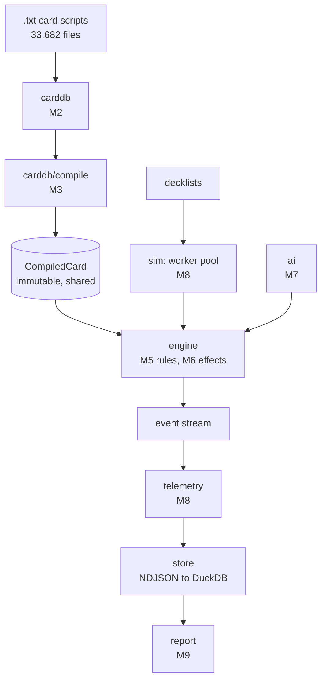

# System Overview

- **Status:** Active
- **Applies to:** the whole of Crucible
- **Describes:** state as of 2026-09-07

The first document to read. What Crucible is, what it is not, what exists today, and what the ADRs commit it to
becoming.

Decisions and their alternatives live in [`../adr/`](../adr/README.md) and are linked, never restated (ARCH-3).

---

## What Crucible is

A batch Magic: The Gathering simulator and analysis tool. It plays one deck against a gauntlet of opposing decks tens or
hundreds of thousands of times, records what happened in each game, and reports where the deck loses.

The output is statistics with an argument attached: which cards sat dead in hand and why, whether the mana base supports
the curve, which cards actually change the win rate, and how the deck performs on the play versus the draw.

It is built on a Go port of the [Forge](https://github.com/Card-Forge/forge) rules engine, in a fork of that project.

---

## What Crucible is not

The boundaries matter more than the features, because most of them are questions people will ask.

| Not                          | Why                                                                                                                         |
| ---------------------------- | --------------------------------------------------------------------------------------------------------------------------- |
| A game client                | No UI, no input, no rendering. Games run headless with both sides played by AI                                              |
| A deck builder               | It evaluates decklists. It does not generate or search them, beyond the A/B swap loop in M9                                 |
| A rules oracle for humans    | It answers "how often does this deck win", never "is this play legal"                                                       |
| A Forge replacement          | Forge is a game people play. Crucible reads its card scripts and ports its engine                                           |
| A general MTG API            | Everything under `internal/` is unimportable by design ([ADR-0003](../adr/0003-go-project-layout.md))                       |
| Able to play arbitrary cards | It refuses any card outside its configured corpus, at deck load, by design ([ADR-0011](../adr/0011-card-corpus-scoping.md)) |

That last one surprises people. Crucible reports statistics, so a card it would play incorrectly is more dangerous than
a card it refuses — a wrong win rate across 100,000 games looks exactly as confident as a right one.

---

## What exists today

**No Go code. `crucible/` has not been created.**

```text
find crucible -name '*.go' 2>/dev/null | wc -l     ->  0        (2026-09-07)
```

What exists is the decision and rule set that governs the code before it is written:

| Artefact           | Count | Command                                      |
| ------------------ | ----: | -------------------------------------------- |
| Crucible documents |    36 | `find docs/crucible -name '*.md' \| wc -l`   |
| Accepted ADRs      |    11 | `ls docs/crucible/adr/0*.md \| wc -l`        |
| Guidelines         |     7 | `ls docs/crucible/guidelines/0*.md \| wc -l` |

And what it is built on, inherited from upstream Forge:

| Input               |                         Size | Command                                                                                       |
| ------------------- | ---------------------------: | --------------------------------------------------------------------------------------------- |
| Card scripts        | 33,682 files / 302,710 lines | `find forge-gui/res/cardsfolder -name '*.txt' \| wc -l`                                       |
| Java port surface   |                209,810 lines | `find forge-{core,game,ai}/src/main/java -name '*.java' -exec cat {} + \| wc -l`              |
| Java tree, total    |                517,069 lines | `find . -name '*.java' -not -path '*/target/*' -exec cat {} + \| wc -l`                       |
| Java tests          |                          456 | `grep -rh '@Test' forge-gui-desktop/src/test forge-game/src/test --include='*.java' \| wc -l` |
| Decklists available |                       14,035 | `find forge-gui/res -name '*.dck' \| wc -l`                                                   |

Everything in the next two sections is target state, and each stage names the milestone that builds it.

---

## Target shape



One `CompiledCard` set is shared read-only by every game in a run; each game is one goroutine with its own state and its
own RNG streams. See [ADR-0005](../adr/0005-concurrency-model.md), [ADR-0006](../adr/0006-determinism-and-rng.md),
[ADR-0007](../adr/0007-card-dsl-representation.md).

---

## Data flow, end to end

Traced from a card script to a figure in a report. No stage is skipped; unbuilt stages name their milestone (ARCH-8).

| #   | Stage            | Transforms                                                                   | Milestone                |
| --- | ---------------- | ---------------------------------------------------------------------------- | ------------------------ |
| 1   | `carddb`         | `.txt` text to `CardRules`                                                   | M2                       |
| 2   | `carddb/compile` | `CardRules` to typed AST, `SubAbility$` chains resolved to direct references | M3                       |
| 3   | Corpus gate      | Decklists to a support verdict; an unsupported card stops the run here       | M2 (tool), M6 (complete) |
| 4   | `sim`            | A run specification to per-game work items, each with a derived seed         | M8                       |
| 5   | `engine`         | Work item to a played game, emitting typed events                            | M5, M6                   |
| 6   | `ai`             | Game state to a decision, through the `PlayerController` interface           | M7                       |
| 7   | `telemetry`      | Event stream to per-game rows — hand tenure, mana samples, outcome           | M8                       |
| 8   | `store`          | Rows to NDJSON shards, merged into DuckDB                                    | M8                       |
| 9   | `report`         | Queries to matchup matrix, dead-card table, mana health, per-card impact     | M9                       |

Two things cross the whole flow. A run seed and game index reproduce any single game in isolation
([ADR-0006](../adr/0006-determinism-and-rng.md)). A `manifest.json` records the git SHA, engine version, schema and
metric versions, seeds, deck hashes and every metric threshold — a run that cannot be reproduced from its manifest is a
bug.

---

## How the Java tree relates

The most common misunderstanding, so it is stated plainly.

**Crucible never executes Java.** The shipped artefact is one Go binary plus the card script files it reads as data. No
JVM is required to run a simulation.

The Java tree serves three distinct purposes:

| Purpose                 | What it means                                                                                                                                                                      |
| ----------------------- | ---------------------------------------------------------------------------------------------------------------------------------------------------------------------------------- |
| **Port source**         | 209,810 lines of `forge-core`, `forge-game`, `forge-ai` are the behaviour being reproduced                                                                                         |
| **Differential oracle** | The Java engine generates golden outputs that Go is diffed against, in CI only ([ADR-0010](../adr/0010-differential-testing-strategy.md))                                          |
| **Card script supply**  | `forge-gui/res/cardsfolder/` is read directly by the Go engine at runtime. Upstream additions arrive with no conversion ([ADR-0001](../adr/0001-fork-layout-and-upstream-sync.md)) |

So "no long-term hybrid" is true of the runtime and false of the build. Deleting the oracle would remove the only
mechanism that proves rule accuracy.

Crucible owns exactly two paths — `crucible/` and `docs/crucible/` — plus root tooling config. Everything else belongs
to upstream and is not edited; anything that lands outside those paths is logged in
[`../porting/upstream-patches.md`](../porting/upstream-patches.md).

---

## Invalidated by

- `crucible/` gaining its first Go file — the "what exists today" section becomes wrong immediately
- Any milestone in the data flow table completing
- A new top-level package that is not in [`module-map.md`](module-map.md)
- Crucible acquiring a runtime dependency on the JVM, which would contradict the section above and require an ADR

## Related

- [`module-map.md`](module-map.md) — every Go package, once packages exist
- [`../adr/README.md`](../adr/README.md) — the eleven decisions this describes the result of
- [`../00-master-implementation-plan.md`](../00-master-implementation-plan.md) — milestones and their exit gates
- [`../guidelines/06-architecture-docs.md`](../guidelines/06-architecture-docs.md) — `ARCH-n`, the rules this document
  follows
