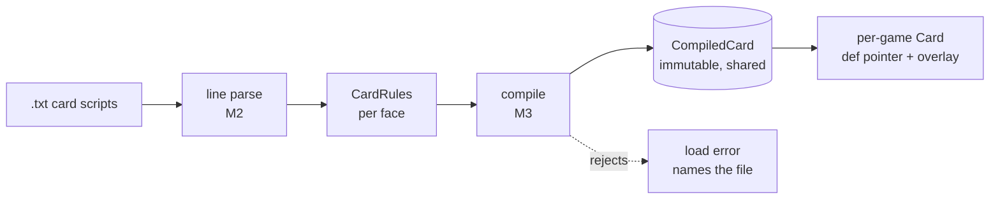

# Card Compilation Pipeline

- **Status:** Target — nothing here is built
- **Real at:** M2 (`carddb`), M3 (`carddb/compile`)
- **Composes:** ADR-0007, ADR-0008, ADR-0011, and the six DSL grammars

How tens of thousands of text files become an immutable structure every game shares. Reasoning stays in the ADRs and is
linked (ARCH-3).

The input side is fully specified — six grammars derived from the corpus — so this is the one pipeline whose shape is
known before any of it exists.

---

## Stages



| Stage | Input          | Output                                                 | Package          | Milestone |
| ----- | -------------- | ------------------------------------------------------ | ---------------- | --------- |
| 1     | `.txt` bytes   | `Key:Value` lines, per face                            | `carddb/script`  | M2        |
| 2     | Lines          | `CardRules` — raw strings still                        | `carddb`         | M2        |
| 3     | Raw strings    | Typed AST, `SubAbility$` resolved to direct references | `carddb/compile` | M3        |
| 4     | AST            | `CompiledCard`, frozen                                 | `carddb`         | M3        |
| 5     | `CompiledCard` | Per-game `Card` holding a pointer plus an overlay      | `engine`         | M4        |

Stage 3 is where the six grammars are consumed. Each has its own parser and they compose in one direction:

```text
card script ──► param map ──► cost string ──► count expression ──► valid string
                          └──► keyword ──────────┘
```

Cost strings embed count expressions, count expressions embed valid strings. That ordering is forced by the grammars,
not chosen: `Count$Valid Creature.YouCtrl/Times.2` contains all three.

---

## What is shared and what is not

The distinction the whole design rests on ([ADR-0007](../adr/0007-card-dsl-representation.md)):

|            | Compiled definition                                                 | Runtime overlay                         |
| ---------- | ------------------------------------------------------------------- | --------------------------------------- |
| Holds      | Abilities, triggers, statics, replacements, costs, definition SVars | SVars written during play               |
| Lifetime   | Process                                                             | One card, one game                      |
| Mutable    | No, after load                                                      | Yes                                     |
| Allocated  | Once per card name                                                  | Only on first write — most cards never  |
| Written by | The compiler                                                        | 15 effect classes, `GameAction`, `Card` |

**Java conflates these under one name, which is why it cannot cache.** Because any SVar might be written, none can be
shared, so `AbilityFactory` re-parses per card instance per game — roughly 10^8 times across a million-game run.

Splitting them is what makes the sharing safe.

---

## Failure is at load, and it names the file

**A malformed script fails the load. It never throws mid-game.**

That is a deliberate inversion of Java's behaviour, where an unparseable ability surfaces as a `RuntimeException` the
first time some card reaches it — possibly on card 12,004 of a 100,000-game batch.

Three failure classes, all at stage 3:

| Failure                                                                            | Response                                                                                                                                                                                   |
| ---------------------------------------------------------------------------------- | ------------------------------------------------------------------------------------------------------------------------------------------------------------------------------------------ |
| Unknown vocabulary — a `Key$`, property, count head or cost part no grammar covers | Hard error. The P2 gate requires zero, and deliberate exclusions live in [`../porting/parity-matrix.md`](../porting/parity-matrix.md)                                                      |
| Malformed syntax within a known construct                                          | Hard error naming the file and line                                                                                                                                                        |
| Known construct, unimplemented API                                                 | Compiles. The registry slot holds a sentinel ([ADR-0008](../adr/0008-effect-dispatch.md)), and the card is refused at _deck_ load instead ([ADR-0011](../adr/0011-card-corpus-scoping.md)) |

The third is the subtle one. An unimplemented API is not a compilation failure, because during M6 most of them are
unimplemented and the corpus gate — not the compiler — decides whether that matters for the decks being run.

---

## Corpus scope does not change the pipeline

[ADR-0011](../adr/0011-card-corpus-scoping.md) scopes support by decklist, but **every script compiles**. Scoping
applies at deck load, not at card compilation.

Compiling everything is what makes the L1 static-parity gate total: the Java dumper and the Go compiler both process the
whole corpus, so a parser divergence is caught across 100% of cards before any game runs
([ADR-0010](../adr/0010-differential-testing-strategy.md)).

Compiling only the corpus would make that gate as narrow as the gauntlet.

---

## Cost

Load work is O(cards in corpus), once per process, against O(cards x games) in Java. For a run of 10^5 games that is the
largest single performance difference between the two engines, and it is the reason
[ADR-0005](../adr/0005-concurrency-model.md)'s shared card database is worth having at all.

The trade is startup latency: every script compiles before the first game begins. Irrelevant for a batch run of hours,
noticeable when iterating on one fixture — which argues for a corpus-scoped load in test binaries, not for lazy
compilation.

---

## Unresolved

Listed rather than smoothed over (ARCH-10).

- **Overlay representation.** Copy-on-write is decided; map, small slice, or inline array is a measurement nobody can
  take until a game state exists. M5.
- **Compile-time budget.** No measurement exists for how long compiling the whole corpus takes in Go, so "irrelevant for
  a batch run" is an expectation rather than a finding. M2 gives the first number.
- **Whether `CompiledCard` is reachable by name or index.** Deck loading resolves names; the engine wants an index. The
  boundary between them is unsettled.
- **Functional variants.** 297 `Variant:` lines and 95 `SPECIALIZE:` exist in the corpus; whether a variant is a
  separate `CompiledCard` or a mode within one is undecided.

## Invalidated by

- `internal/carddb` existing — this is replaced by an architecture document describing what was built
- ADR-0007 being superseded
- A seventh grammar appearing, which would change the stage-3 composition order

## Related

- [`../porting/dsl/README.md`](../porting/dsl/README.md) — the six grammars stage 3 consumes
- [ADR-0007](../adr/0007-card-dsl-representation.md), [ADR-0008](../adr/0008-effect-dispatch.md),
  [ADR-0010](../adr/0010-differential-testing-strategy.md), [ADR-0011](../adr/0011-card-corpus-scoping.md)
- [`engine-design.md`](engine-design.md) — what happens to a `CompiledCard` once a game holds it
