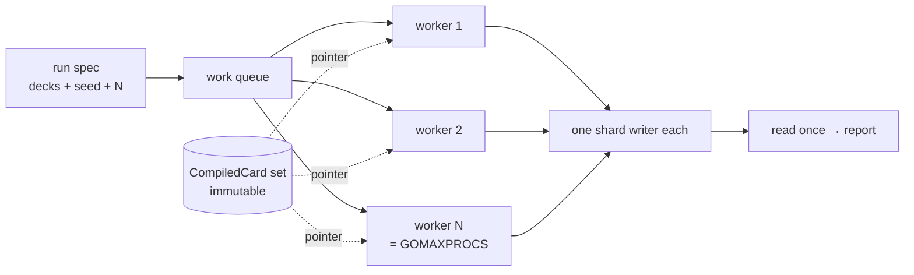

# Concurrency and Determinism

- **Status:** Target — nothing here is built
- **Real at:** M8 (`sim`), with the guarantees depending on M4–M7
- **Composes:** ADR-0005, ADR-0006, ADR-0009

How a run is executed and what reproducibility actually guarantees. Reasoning stays in the ADRs and is linked (ARCH-3);
the composition inside a single game is in [`engine-design.md`](engine-design.md) and is not repeated here.

This document answers one question the ADRs do not: **given a `manifest.json`, what exactly can be reproduced, and what
cannot?**

---

## Execution

| Element      | Rule                                                                                    |
| ------------ | --------------------------------------------------------------------------------------- |
| Unit of work | One game. Never a turn, an effect, or a search branch                                   |
| Workers      | Bounded, `GOMAXPROCS` by default — goroutines are cheap, game states are not            |
| Shared       | The card database and the effect registry, both frozen before the first game            |
| Per worker   | One shard writer, so no accumulator is contended                                        |
| Failure      | Recovered at the game boundary; that game is recorded as failed and the batch continues |

---

## What a seed reproduces, and what it does not

The distinction that matters when someone tries to reproduce a result and cannot.

| Given                        | Reproduces                       | Why                                                                        |
| ---------------------------- | -------------------------------- | -------------------------------------------------------------------------- |
| `runSeed` + `gameIndex`      | **One exact game**               | Per-stream seeds derive from both; nothing else influences them (ADR-0006) |
| `runSeed` + N                | **The whole run, game for game** | Game index is assigned from the queue position, not from completion order  |
| `runSeed` alone, different N | Games 0..min(N) only             | A shorter run is a prefix, not a different sample                          |
| A failed game's record       | That failure in isolation        | It carries its own seed, so no re-run of the batch is needed               |

**Worker count does not affect results.** Two runs with the same seed and different `GOMAXPROCS` produce identical
telemetry, because a game's streams depend on its index and never on which worker took it or when.

That is the property everything else protects, and it is worth stating as a testable claim rather than an aspiration:
**M8's exit gate is a re-run at a different worker count producing byte-identical output.**

---

## What would break it, and what stops each

Each row is a way determinism dies quietly. None fails loudly on its own.

| Hazard                                                                        | What stops it                                                         |
| ----------------------------------------------------------------------------- | --------------------------------------------------------------------- |
| A shared RNG across games                                                     | Streams derive from `runSeed` + `gameIndex` (ADR-0006)                |
| `math/rand`'s package-level global source                                     | `depguard` denies the import outside `pkg/javarand`                   |
| A clone consuming the parent's stream — so shuffles depend on AI search depth | Clones get a detached RNG ([`engine-design.md`](engine-design.md) §4) |
| Map iteration order deciding trigger order                                    | `collect.OrderedSet` where Java used `FCollection` (GO-12)            |
| Package-level mutable state                                                   | Banned by GO-2, enforced by review and `-race` under parallel tests   |
| Completion order leaking into output                                          | Game index is assigned at dispatch; telemetry rows carry it           |
| Wall-clock or environment reaching a decision                                 | TEST-11 forbids both in tests; nothing in the engine reads either     |

**`-race` on a parallel test suite is load-bearing here, not hygiene.** It is the only thing that catches a silently
shared pointer, which is the highest-probability bug to import from Java's mutable statics.

---

## Two modes, and why the mode is recorded

[ADR-0006](../adr/0006-determinism-and-rng.md) has two generators, and a run is only comparable to another in the same
mode:

| Mode       | Generator              | Used for                                          |
| ---------- | ---------------------- | ------------------------------------------------- |
| Production | `math/rand/v2` ChaCha8 | Every real run                                    |
| Parity     | `pkg/javarand`         | Differential testing against the Java oracle only |

The mode belongs in `manifest.json` and in the parity harness output. Without it, someone compares a ChaCha8 run against
the oracle, finds every shuffle differs, and loses an afternoon to a configuration difference that looks like a rules
bug.

---

## Unresolved

Listed rather than smoothed over (ARCH-10).

- **Worker count against memory.** ADR-0005 makes memory the scaling limit and ADR-0009 makes clones cheap, so worker
  count and AI search depth are coupled. Neither has a number until a game state exists to measure. M7.
- **Failed-game accounting.** A recovered panic produces a failed game. Whether it counts in the denominator of a win
  rate, or is excluded and reported separately, is unsettled and affects every reported figure.
- **Cross-platform reproducibility.** Nothing here guarantees a run on arm64 matches one on amd64. Floating point in the
  AI evaluator is the likely divergence, and no measurement exists.

## Invalidated by

- `internal/sim` existing — replaced by an architecture document describing what was built
- Any measurement showing worker count affecting output, which would contradict the central claim above

## Related

- [ADR-0005](../adr/0005-concurrency-model.md), [ADR-0006](../adr/0006-determinism-and-rng.md),
  [ADR-0009](../adr/0009-game-state-representation.md)
- [`engine-design.md`](engine-design.md) — composition inside one game
- [`../telemetry/metric-definitions.md`](../telemetry/metric-definitions.md) — MET-1, versioning that makes runs
  comparable
