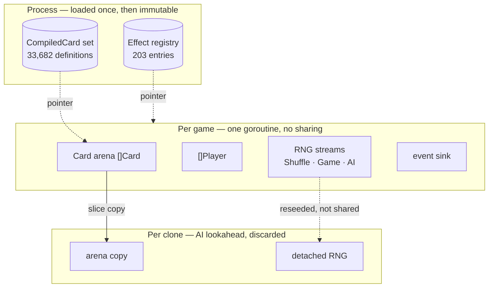

# Engine Design

- **Status:** Target — nothing here is built
- **Real at:** M3 (compilation), M5 (rules kernel), M6 (effects)
- **Composes:** ADR-0003, ADR-0005, ADR-0006, ADR-0007, ADR-0008, ADR-0009

What five accepted ADRs add up to. Reasoning stays in the ADRs and is linked, never restated (ARCH-3).

This exists because ADRs are narrow by design. Each argues one decision; none shows how the pieces compose. M5 is the
largest milestone in the plan at 6–10 weeks, and entering it with the design spread across five decision records is how
every ADR gets individually satisfied while the assembled thing is incoherent.

---

## The shape

Four kinds of data with four different lifetimes. Almost every interaction question below is answered by knowing which
kind something is.



## Lifetimes and mutability

The table nothing currently states, and the one M5 needs on day one.

| Data                          | Lifetime | Mutable              | Shared across games | Copied on clone            |
| ----------------------------- | -------- | -------------------- | ------------------- | -------------------------- |
| `CompiledCard` definitions    | Process  | **No**, after load   | Yes, by pointer     | No — pointer only          |
| Effect registry               | Process  | **No**, after wiring | Yes, by pointer     | No — pointer only          |
| `Game`, arena, players, zones | One game | Yes                  | **Never**           | Yes                        |
| Per-card runtime overlay      | One card | Yes                  | Never               | **Yes**                    |
| RNG streams                   | One game | Yes                  | Never               | **Detached, not copied**   |
| Event sink                    | One game | Yes                  | Never               | **Not attached to clones** |

Two rows in that table are the ones that will otherwise be found the hard way, and they are expanded below.

---

## Five interactions no single ADR owns

Each of these is a question a reader of the ADRs cannot answer, because the answer lives between two of them.

### 1 · The runtime overlay is cloned

[ADR-0007](../adr/0007-card-dsl-representation.md) puts runtime-written SVars in a per-card overlay.
[ADR-0009](../adr/0009-game-state-representation.md) makes clone a slice copy of the arena.

**The overlay clones with its card**, because it is per-card mutable state and a lookahead line that writes one must not
reach the real game. It is cheap: overlays are copy-on-write and most cards never allocate one, so the common case
copies a nil map header.

### 2 · Compiled definitions are never deep-copied

A `Card` in the arena holds `def *CompiledCard`. A slice copy copies the pointer, which is correct and must stay that
way — deep-copying 33,682 shared definitions per clone would make lookahead unusable and would violate the immutability
the sharing depends on ([ADR-0005](../adr/0005-concurrency-model.md)).

Correct by construction rather than by discipline, provided `Card` never gains a by-value definition field.

### 3 · The effect registry is frozen after wiring

[ADR-0008](../adr/0008-effect-dispatch.md) has `cmd/` call `effect.Register(&reg)` at startup. After that call the
registry is read-only and shared by pointer, exactly like the card database.

Nothing may register during a game. A mutable registry would be package-level mutable state reached from every goroutine
— the thing [GO-2](../guidelines/01-go-coding-standards.md) exists to prevent, arriving through a door that looks like
configuration.

### 4 · A clone gets a detached RNG, never the game's

**This is the interaction most likely to be missed, and it corrupts results silently.**

[ADR-0006](../adr/0006-determinism-and-rng.md) gives each game partitioned RNG streams.
[ADR-0009](../adr/0009-game-state-representation.md) makes clones cheap so the AI takes many.

If a clone shared the real game's RNG, every lookahead line the AI explored would advance the stream — so the shuffle
after an AI decision would depend on **how hard the AI thought**, not on the seed. Reruns would diverge, and
reproducibility from `runSeed` plus `gameIndex` would be false.

A clone therefore gets its own RNG, deterministically derived from the parent's state and the clone index, and
**consumption inside a clone never advances the parent's streams**.

### 5 · Clones emit no telemetry

Same shape, different victim. The AI explores lines that never happened; if a clone held the game's event sink, every
imagined cast would land in the telemetry as though it were real, and every metric in
[`metric-definitions.md`](../telemetry/metric-definitions.md) would be computed over hypothetical games.

A clone's sink is a discard. The dead-card castability probe (MET-5) runs on the real game only.

---

## A game, end to end

Which decision governs each step. Nothing here is built; the milestone column says when it becomes real.

| Step                                                                         | Governed by                     | Milestone |
| ---------------------------------------------------------------------------- | ------------------------------- | --------- |
| Process start: load 33,682 scripts, compile definitions, freeze              | ADR-0007                        | M2, M3    |
| Wire the effect registry from `cmd/`, freeze                                 | ADR-0008                        | M6        |
| Worker pulls a game spec; derive per-stream seeds from run seed + game index | ADR-0005, ADR-0006              | M8        |
| Build `Game`: arena of cards pointing at shared definitions, players, zones  | ADR-0009                        | M4        |
| Shuffle, mulligan, opening hands                                             | ADR-0006 (Shuffle stream)       | M5        |
| Turn loop: untap, upkeep, draw, main, combat, end                            | ADR-0003 (engine core)          | M5        |
| Priority; a controller answers through `PlayerController`                    | ADR-0010 (scripted, replay, AI) | M5, M7    |
| AI lookahead: clone, play out, score, discard                                | ADR-0009 + interactions 4 and 5 | M7        |
| Resolution: registry lookup by API type, effect mutates the game             | ADR-0008                        | M6        |
| Recorder folds events in place; rows to the shard at game end                | ADR-0013                        | M8        |
| Game ends; worker records the outcome and takes the next spec                | ADR-0005                        | M8        |

## Where the packages sit

One arrow direction, into `engine`, never out ([ADR-0003](../adr/0003-go-project-layout.md)):

```text
carddb ──► carddb/compile ──►  (CompiledCard, immutable)
                                      │
mana, cardtype  ───────────────►  internal/engine  ◄─── engine/effect
                                      ▲                 valid, expr
                                      │                 ai
                              sim, telemetry
```

`engine` is one package because 82 package cycles in `forge-game` make the mirrored layout uncompilable. Everything that
can be acyclic is outside it, and the arrow direction is what the compiler enforces.

---

## Unresolved

Listed rather than smoothed over (ARCH-10). Each needs an ADR or a measurement before the milestone that hits it.

- **Clone depth and memory.** ADR-0005 makes memory the scaling limit and ADR-0009 makes clones cheap, so worker count
  and AI search depth are coupled. Neither has a number, and neither can until a game state exists to measure. M7.
- **Overlay representation.** Copy-on-write is stated; whether the overlay is a map, a small slice, or an inline array
  is a measurement, not a decision. M5.
- **LKI snapshots.** ADR-0009 forbids handle reuse so last-known-information stays valid, but does not say whether an
  LKI snapshot is a card copy or a handle plus a timestamp. M5.

## Invalidated by

- Any of the five interactions above being contradicted by an implementation
- The first `internal/engine` code, which starts replacing this with an architecture document under
  [`../architecture/`](../architecture/system-overview.md)

## Related

- [ADR-0003](../adr/0003-go-project-layout.md), [ADR-0005](../adr/0005-concurrency-model.md),
  [ADR-0006](../adr/0006-determinism-and-rng.md), [ADR-0007](../adr/0007-card-dsl-representation.md),
  [ADR-0008](../adr/0008-effect-dispatch.md), [ADR-0009](../adr/0009-game-state-representation.md)
- [`../architecture/system-overview.md`](../architecture/system-overview.md) — the outer boundary this sits inside
- [`../guidelines/06-architecture-docs.md`](../guidelines/06-architecture-docs.md) — ARCH-10
