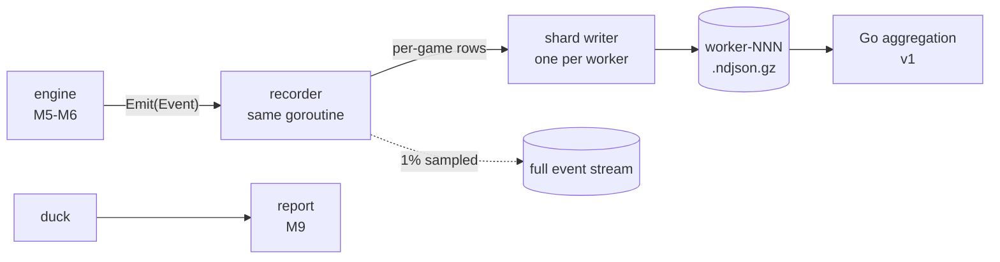

# Telemetry Pipeline

- **Status:** Target — nothing here is built
- **Real at:** M8 (`telemetry`, `store`), M9 (`report`)
- **Composes:** ADR-0005, ADR-0006, ADR-0013, ADR-0014, and the metric definitions

An engine event to a figure in a report, end to end, with no stage skipped (ARCH-8). Reasoning stays in the ADRs and is
linked (ARCH-3).

---

## Stages

| #   | Stage        | Transforms                              | Where it runs                          | Milestone                    |
| --- | ------------ | --------------------------------------- | -------------------------------------- | ---------------------------- |
| 1   | Emission     | Game action to a flat `Event`           | Game goroutine, no allocation          | M5                           |
| 2   | Folding      | `Event` to accumulator updates          | **Same goroutine, synchronously**      | M8                           |
| 3   | Probing      | Once per turn, hand to castability rows | Game goroutine, needs the rules engine | M5 for support, M8 to record |
| 4   | Row emission | Accumulators to ~80 rows                | Game end                               | M8                           |
| 5   | Shard write  | Rows to `ndjson.gz`                     | Worker, one writer, append-only        | M8                           |
| 6   | Query        | Shards to aggregates                    | Go, streaming; DuckDB later (ADR-0016) | M9                           |
| 7   | Rendering    | Aggregates to Markdown, HTML, JSON      | `report`                               | M9                           |

**Stage 2 runs in the game's own goroutine, and that is the load-bearing choice.** There is no queue on the common path,
so nothing about machine load can reach the output ([ADR-0013](../adr/0013-telemetry-event-bus.md)).

---

## Stage 3 is the one that cannot be retrofitted

Every other stage transforms data that already exists. The castability probe **asks the rules engine a question**: for
each card in hand, could it be cast right now, and if not, why.

That answer exists only while the game is running, and only the engine can produce it. It is also what separates
`TurnsBlocked` from `TurnsPlayableUnused` — a card that could not be cast indicts the mana base, a card the AI did not
want indicts the card ([MET-4](../telemetry/metric-definitions.md), MET-8).

**So M5 must ship engine support for a question only M8 consumes.** That is a real cross-milestone dependency and the
main reason `metric-definitions.md` was written before any engine code.

The colour attribution in MET-6 has the same shape: it needs the mana solver run **twice**, once against real sources
and once against a hypothetical all-colour pool. No post-hoc analysis can recover it.

---

## Volume

From [ADR-0013](../adr/0013-telemetry-event-bus.md):

| Run        |       Rows | Stored, gzip |
| ---------- | ---------: | -----------: |
| 10^5 games |  8,000,000 |     ~0.20 GB |
| 10^6 games | 80,000,000 |      ~2.0 GB |

The event stream behind those rows is larger and is discarded after folding, except for the ~1% of games recorded at
full detail.

---

## What crosses which boundary

| Boundary                | Carries                               | Direction                                                                              |
| ----------------------- | ------------------------------------- | -------------------------------------------------------------------------------------- |
| `engine` to `telemetry` | The `Sink` interface only             | Engine knows nothing downstream (ADR-0012)                                             |
| Game to worker          | Finished per-game rows, once per game | Not per event                                                                          |
| Worker to disk          | Its own shard, no coordination        | Independence preserved to disk (ADR-0005)                                              |
| Disk to report          | Files, read once and streamed         | Go for v1; DuckDB invoked, never imported, when a query needs SQL (ADR-0014, ADR-0016) |

A clone's sink is a discard, so AI lookahead contributes nothing ([`engine-design.md`](engine-design.md) §5).

---

## Two versions, and what each governs

| Version          | Governs                                      | Increments when                                                                         |
| ---------------- | -------------------------------------------- | --------------------------------------------------------------------------------------- |
| `SchemaVersion`  | What was emitted — kinds, fields, row shapes | An event kind or column is added or changed                                             |
| `MetricsVersion` | How it was interpreted                       | A definition or default threshold changes ([MET-1](../telemetry/metric-definitions.md)) |

They move independently, and both are stamped on every row and every shard. Tooling refuses to merge shards whose
`SchemaVersion` differs, because a silent union produces a column meaning one thing for half the rows.

Every run also carries a `manifest.json` with the git SHA, both versions, seeds, deck hashes, the gauntlet, and every
metric threshold in force. **A run that cannot be reproduced from its manifest is a bug.**

---

## Unresolved

Listed rather than smoothed over (ARCH-10).

- **Failed-game accounting.** A recovered panic produces a failed game. Whether it counts in a win rate's denominator or
  is excluded and reported separately is undecided, and it affects every reported figure.
- **Recorder cost.** Folding synchronously puts the recorder in the game's critical path (ADR-0013's stated cost). No
  benchmark exists, so "negligible" is an expectation. M8 gives the first number.
- **Sampling policy for `LevelFull`.** 1% is a placeholder. Whether sampling is uniform, stratified by matchup, or
  biased toward unusual outcomes is unsettled, and it decides what drill-down can answer.
- **Report output formats and CLI shape.** Deferred to its own ADR, still unwritten. Stage 7 is a placeholder here.

## Invalidated by

- `internal/telemetry` or `internal/store` existing — replaced by an architecture document describing what was built
- The reporting ADR landing, which settles stage 7
- Any measurement showing recorder cost is not negligible, which would reopen ADR-0013's synchronous folding

## Related

- [ADR-0013](../adr/0013-telemetry-event-bus.md), [ADR-0014](../adr/0014-telemetry-storage-format.md)
- [`../telemetry/metric-definitions.md`](../telemetry/metric-definitions.md) — the emissions this must carry
- [`engine-design.md`](engine-design.md), [`concurrency-and-determinism.md`](concurrency-and-determinism.md)
