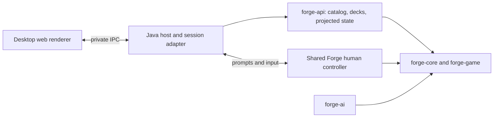

# Forge engine API foundation

This fork targets a desktop application with a web UI: a fast deck workshop and
an Arena-inspired match experience, backed by Forge's existing rules and AI.
`forge-api` supplies catalog, deck, and match hooks. It depends on the shared
`forge-gui` module (including the human controller), `forge-ai`, `forge-game`, and
`forge-core`. It creates no Swing or LibGDX UI; `HeadlessPlatform` supplies the
shared controller's platform services and preferences.

The [Mana Table desktop beta](../forge-desktop/README.md) now consumes this
module through `DesktopEngine`, a private stdin/stdout JSON transport. It includes
local deck persistence, opening-hand practice, and human-versus-AI matches. Build with
`mvn -pl forge-api -am verify`; the executable engine is `target/forge-engine.jar`.

## Implemented

| Hook | Behavior |
| --- | --- |
| `EngineResources.load(path)` | Explicit, once-per-process initialization from Forge's resource directory |
| `CardCatalog.search(query)` | Name/type/rules search across all card faces, accent-insensitive matching, color and mana-value filters, deterministic pagination, printing IDs |
| `DeckImport.preview(text)` | Forge's existing deck recognizer with line-numbered problems; imports cannot silently discard unresolved rows |
| `DeckEditor.apply(revision, edits)` | Atomic batches of absolute quantities across deck sections; stale writes fail |
| `DeckEditor.undo/redo(revision)` | Bounded history, monotonically increasing revisions |
| `DeckEditor.validate(format)` | Forge's structural deck validation; not Standard/Modern set or ban-list legality |
| `DeckEditor.toDeck()` | Detached Forge deck for existing persistence and match setup |
| `GameStateMapper.snapshot(view, viewer)` | Immutable records containing turn, phase, players, life, priority, zone counts, visible cards |
| `GameObservation` | Pollable event revision with explicit unsubscribe/close; raw events never cross the API |
| `MatchSetup` | Validated match copy with a selectable commander when an imported list has no Commander section |
| `MatchSession` | One human-versus-AI Constructed or Commander game, cached state, scoped prompts, controller input, and concession |
| `MatchActivity` | Immutable, viewer-filtered recent actions and event-time turn/phase metadata |

The records contain values rather than live engine objects and can be serialized
by a future IPC or HTTP adapter. This module does not start a network listener.
Printing IDs are opaque, case-sensitive identifiers; clients must round-trip them.
Catalog construction eagerly indexes the supplied printings. Initialize it once
on a worker thread; search results include alternate printings rather than grouping
them into a single card. Color masks are W=1, U=2, B=4, R=8, G=16; zero finds colorless
cards. A nonzero allowed-color mask also includes colorless cards. This is a card
color filter, not a Commander color-identity legality check.

`CardCatalog.fromDatabases(data.getAvailableDatabases().values())` includes both
ordinary and supplemental cards. The desktop uses `browse(..., unique=true)` to
group printings by name. Each page includes `catalogTotal` before filtering, while
`total` counts matching cards. `CardInfo.deckSection` identifies the appropriate
section for supplemental cards. Resource loading includes scripted casual cards
and scripts whose edition is unknown; it does not invent unsupported card rules.

## Build and run

From the repository root, with JDK 17 and Maven 3.8.1+:

```sh
mvn -pl forge-api -am verify
mvn -pl forge-api -am verify -Papi-example
```

The optional `api-example` profile loads the real resource database, searches printings, imports a deck
with a sideboard, and verifies unknown-card detection. It does not start a match.
The initial resource scan can take time. The unit tests require the checked-in
language files at `forge-gui/res/languages`; they do not load the entire card database.

On this Windows workspace a local Maven download is available at
`.tools/apache-maven-3.9.9/bin/mvn.cmd`, with the dependency cache in `.m2`.
Use `-Dmaven.repo.local=F:\ForgeButBetter\.m2` to reuse that cache and set
`JAVA_HOME=C:\Program Files\BellSoft\LibericaJDK-17`. These local tools and caches
are ignored by Git.

```java
var data = EngineResources.load(Path.of("forge-gui/res"));
var catalog = new CardCatalog(data.getCommonCards());
var page = catalog.search(new CardCatalog.Query("draw", 2, 3, 0, 40));
var editor = new DeckEditor(catalog, new Deck("Blue practice"));
var state = editor.apply(0, List.of(
    new DeckEditor.Edit("Main", page.cards().get(0).id(), 4)));
var restored = editor.undo(state.revision());
```

An existing Forge process should reuse its initialized `StaticData`, not call
`EngineResources.load` again. Include the variant database in the catalog if the
editor needs schemes, planes, and other supplemental cards. Use
`DeckSerializer.writeDeck(editor.toDeck(), file)` for Forge-native saving.
File locations and persistence are the host application's responsibility.

## Game integration contract

Bind a session's viewer in the trusted Java host. Do not accept an arbitrary
viewer ID from the renderer on each request. Capture a snapshot on the thread
that owns the view, after a stable GUI update and after tracker unfreeze. Raw
game events can occur mid-transition; an observation revision is an invalidation
signal, not a promise that a complete state is ready. Do not poll mutable views
from a network/renderer thread. Cache and publish the immutable snapshot instead.

Hidden zones publish counts and only cards Forge allows the viewer to see. Hidden
cards publish no IDs or positional placeholders. Face-down cards are conservatively
redacted, even for their controller; their IDs, type, mana cost and power/toughness
are null. `MatchSession` issues scoped handles for selecting these objects instead
of exposing their underlying card IDs. The original `GameStateMapper` excludes stack
entries, combat assignments, attachments, counters, mana pools, temporary reveal
prompts, face-down controller previews, and spectator sessions. Never serialize
`Game`, `CardView`, alternate states, raw events, or logs directly to a client.

Close `GameObservation` when the host session closes. It retains the game until
closed. Its revision is local to that observation and is not a game replay cursor,
action authorization token, or durable resume ID.

## Playable desktop integration



`MatchSession` adapts `IGuiGame` to structured prompts and reuses
`PlayerControllerHuman`, its input queue, and the existing AI. Snapshots add the
stack, combat flags, counters, mana, and transient reveal choices. Card handles
are scoped to a prompt; the renderer never receives hidden card IDs or raw logs.
The original `GameStateMapper` remains a smaller projection for other consumers.

The desktop host disables automatic passing when no actions are available.
An action such as playing a land returns to a visible priority prompt before
the game can advance. Explicit pass and end-turn inputs still use engine rules.

The private desktop transport exposes:

| Request | Parameters / result |
| --- | --- |
| `matchOpponents` | Lists the green and red AI decks for the current deck's format |
| `matchSetup` | Optional `{commanderId}`; returns deck ID/revision, candidate commanders, validated setup, and opponents |
| `matchStart` | `{opponent, commanderId?, deckId?, revision?}`; validates a detached match deck and rejects stale setup |
| `matchState` | Cached snapshot with session `id`, `revision`, `boardRevision`, `status`, `players`, `stack`, `prompt`, `activity`, and `result` |
| `matchAction` | `{sessionId, promptId, ...answer}`; replies once to the current prompt |
| `matchConcede` | `{sessionId}`; ends the game without editing the deck |

Input answers use `action: ok/cancel/attackAll/card/player`, with `key` for a
visible card or `playerId` for a player. Dialog answers use `choices` (indices in
selection order), `value` (number/text), or `values` (allocations). Reveal prompts
need only the two IDs. The prompt supplies cardinality and range constraints;
the host validates them before dispatch. Combat allocations may allow `action:
skip`. Old session IDs and prompt IDs fail rather than being replayed.

Synchronous dialogs publish a snapshot before waiting on a response future.
Replies complete that future directly; controller input runs on the dedicated
UI executor. This avoids queuing replies behind the blocked game thread. Engine
state is projected at input boundaries, never read live by the IPC request loop.

`activity` retains the latest 120 public event summaries with increasing IDs,
turn/phase, kind, actor or affected player, and a message. It copies an allowlist
at event emission; raw engine logs and spell descriptions are never exported.
Library-to-hand events omit the card identity. During `resolving`, polling may
advance `revision`, turn/phase metadata, and activity while keeping the last stable
board. `boardRevision` changes only when a fresh board snapshot is published.
Clients can update status and history without rebuilding cards during AI work.

Visible cards also have an opaque `visualId` for animation correlation. These
handles are discarded on hidden-zone transitions and omitted for face-down or
hidden cards. They cannot authorize actions: use the current prompt's `key`.
Event IDs and visual IDs belong to one session, not a replay or durable save.

The match beta supports single Constructed and one-on-one Commander games.
Commander setup uses `RegisteredPlayer.forCommander`, the engine's Commander
variant, 40 life, and 100-card singleton AI decks. Missing commander assignments
can be supplied from the main deck for that game without changing the saved list.
Existing commanders, including legal partner pairs, remain intact. Color identity
and deck conformance are checked before launching.

There are no network peers, sideboarding, Limited matches, or durable match saves. Complex card-specific
interactions need broader coverage. Unsupported adapter calls surface an error
and terminate that session so another game can be started safely.

## Upstream maintenance

Keep `upstream` pointed at Card-Forge/forge and `origin` at proflayton/forge.
Shared changes include `Game.unsubscribeFromEvents`, explicit resource/profile
path overrides, and reusing initialized `StaticData` from `FModel.getMagicDb`.
The new host, protocol, and renderer live in their own modules. Preserve
the repository's existing license and attribution. Forge's existing resources
remain the source of truth for card definitions and rules.
