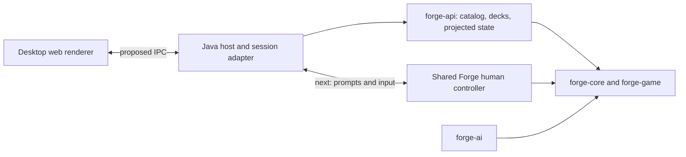

# Forge engine API foundation

This fork targets a desktop application with a web UI: a fast deck workshop and
an Arena-inspired match experience, backed by Forge's existing rules and AI.
`forge-api` is the first integration layer. It depends on `forge-game` and
`forge-core`, and can load cards without Swing, LibGDX, `FModel`, or a GUI process.

The [Forge Workshop desktop beta](../forge-desktop/README.md) now consumes this
module through `DesktopEngine`, a private stdin/stdout JSON transport. It includes
local deck persistence and an opening-hand practice table. Build with
`mvn -pl forge-api -am verify`; the executable engine is `target/forge-engine.jar`.

## Implemented

| Hook | Behavior |
| --- | --- |
| `EngineResources.load(path)` | Explicit, once-per-process initialization from Forge's resource directory |
| `CardCatalog.search(query)` | Case-insensitive name/type/rules search, allowed-color and mana-value filters, deterministic pagination, printing IDs |
| `DeckImport.preview(text)` | Forge's existing deck recognizer with line-numbered problems; imports cannot silently discard unresolved rows |
| `DeckEditor.apply(revision, edits)` | Atomic batches of absolute quantities across deck sections; stale writes fail |
| `DeckEditor.undo/redo(revision)` | Bounded history, monotonically increasing revisions |
| `DeckEditor.validate(format)` | Forge's structural deck validation; not Standard/Modern set or ban-list legality |
| `DeckEditor.toDeck()` | Detached Forge deck for existing persistence and match setup |
| `GameStateMapper.snapshot(view, viewer)` | Immutable records containing turn, phase, players, life, priority, zone counts, visible cards |
| `GameObservation` | Pollable event revision with explicit unsubscribe/close; raw events never cross the API |

The records contain values rather than live engine objects and can be serialized
by a future IPC or HTTP adapter. This module does not start a network listener.
Printing IDs are opaque, case-sensitive identifiers; clients must round-trip them.
Catalog construction eagerly indexes the supplied printings. Initialize it once
on a worker thread; search results include alternate printings rather than grouping
them into a single card. Color masks are W=1, U=2, B=4, R=8, G=16; zero finds colorless
cards. A nonzero allowed-color mask also includes colorless cards. This is a card
color filter, not a Commander color-identity legality check.

## Build and run

From the repository root, with JDK 17 and Maven 3.8.1+:

```sh
mvn -pl forge-api -am verify
mvn -pl forge-api -am verify -Papi-example
```

The optional `api-example` profile loads the real resource database, searches printings, imports a deck
with a sideboard, and verifies unknown-card detection. It does not start a match.
The initial resource scan can take time. The unit tests require the checked-in
language files at `forge-gui/res/languages`; they do not load the entire card database.

On this Windows workspace a local Maven download is available at
`.tools/apache-maven-3.9.9/bin/mvn.cmd`, with the dependency cache in `.m2`.
Use `-Dmaven.repo.local=F:\ForgeButBetter\.m2` to reuse that cache and set
`JAVA_HOME=C:\Program Files\BellSoft\LibericaJDK-17`. These local tools and caches
are ignored by Git.

```java
var data = EngineResources.load(Path.of("forge-gui/res"));
var catalog = new CardCatalog(data.getCommonCards());
var page = catalog.search(new CardCatalog.Query("draw", 2, 3, 0, 40));
var editor = new DeckEditor(catalog, new Deck("Blue practice"));
var state = editor.apply(0, List.of(
    new DeckEditor.Edit("Main", page.cards().get(0).id(), 4)));
var restored = editor.undo(state.revision());
```

An existing Forge process should reuse its initialized `StaticData`, not call
`EngineResources.load` again. Include the variant database in the catalog if the
editor needs schemes, planes, and other supplemental cards. Use
`DeckSerializer.writeDeck(editor.toDeck(), file)` for Forge-native saving.
File locations and persistence are the host application's responsibility.

## Game integration contract

Bind a session's viewer in the trusted Java host. Do not accept an arbitrary
viewer ID from the renderer on each request. Capture a snapshot on the thread
that owns the view, after a stable GUI update and after tracker unfreeze. Raw
game events can occur mid-transition; an observation revision is an invalidation
signal, not a promise that a complete state is ready. Do not poll mutable views
from a network/renderer thread. Cache and publish the immutable snapshot instead.

Hidden zones publish counts and only cards Forge allows the viewer to see. Hidden
cards publish no IDs or positional placeholders. Face-down cards are conservatively
redacted, even for their controller; their IDs, type, mana cost and power/toughness
are null. A future prompt adapter must issue scoped handles for selecting these
objects instead of exposing their underlying card IDs. This first projection excludes stack
entries, combat assignments, attachments, counters, mana pools, temporary reveal
prompts, face-down controller previews, and spectator sessions. Never serialize
`Game`, `CardView`, alternate states, raw events, or logs directly to a client.

Close `GameObservation` when the host session closes. It retains the game until
closed. Its revision is local to that observation and is not a game replay cursor,
action authorization token, or durable resume ID.

## Path to a playable desktop client



1. Build the desktop shell and deck workshop around search, paste preview, section
   editing, undo, mana curve, validation, and persistence. Use debounced search and
   virtualized card lists; keep animations in the renderer.
2. Add a Java host adapter for `IGuiGame` and `IGameController`. Reuse
   `PlayerControllerHuman` and the existing input queue for priority, target
   selection, mulligans, mana payment, attackers/blockers, and modal choices.
   These still live in `forge-gui`; `forge-api` alone cannot run a human match.
   Supply `IGuiBase` services and match/resource setup required by that adapter.
3. Give every prompt an ID, player binding, allowed choices, and cardinality;
   accept each response once and reject old prompt IDs. Dispatch input through
   Forge's existing controller threading model. Its synchronous prompts block the
   game loop, so queueing their replies behind that same blocked loop would deadlock.
4. Extend the projection with stack/combat/mana/counters and transient reveals,
   testing each visibility rule. Send ordered snapshots/events to the renderer;
   renderer animation timing must not determine game rules.
5. Package the Java runtime with the desktop application. A desktop main process
   should own the engine subprocess and IPC. If a loopback HTTP/WebSocket transport
   is chosen, bind it locally and authenticate each session.

The desktop shell, local transport, and deck workshop are implemented in
`forge-desktop`. The match launcher, prompt adapter, and full gameplay
presentation remain follow-up work; the beta is not a playable headless human-match server.

## Upstream maintenance

Keep `upstream` pointed at Card-Forge/forge and `origin` at proflayton/forge.
The only engine implementation change is the counterpart to event subscription,
`Game.unsubscribeFromEvents`. The new Maven module is otherwise additive. Preserve
the repository's existing license and attribution. Forge's existing resources
remain the source of truth for card definitions and rules.
