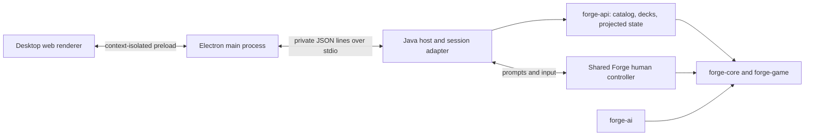

# Mana Table engine API

Mana Table is a desktop application with a web UI: a deck workshop and playable
match table, backed by Forge's existing rules and AI.
`forge-api` supplies catalog, deck, and match hooks. It depends on the shared
`forge-gui` module (including the human controller), `forge-ai`, `forge-game`, and
`forge-core`. It creates no Swing or LibGDX UI; `HeadlessPlatform` supplies the
shared controller's platform services and preferences.

The [Mana Table desktop beta](../forge-desktop/README.md) consumes this
module through `DesktopEngine`, a private stdin/stdout JSON transport. It includes
local deck persistence, opening-hand practice, and human-versus-AI matches. Build with
`mvn -pl forge-api -am verify`; the executable engine is `target/forge-engine.jar`.

## Implemented

| Hook | Behavior |
| --- | --- |
| `EngineResources.load(path)` | Explicit, once-per-process initialization from Forge's resource directory |
| `CardCatalog.search(query)` | Name/type/rules search across all card faces, accent-insensitive matching, color and mana-value filters, deterministic pagination, printing IDs |
| `DeckImport.preview(text)` | Forge's existing deck recognizer with line-numbered problems; imports cannot silently discard unresolved rows |
| `DeckEditor.apply(revision, edits)` | Atomic batches of absolute quantities across deck sections; stale writes fail |
| `DeckEditor.undo/redo(revision)` | Bounded history, monotonically increasing revisions |
| `DeckEditor.validate(format)` | Forge's structural deck validation; not Standard/Modern set or ban-list legality |
| `DeckEditor.toDeck()` | Detached Forge deck for existing persistence and match setup |
| `GameStateMapper.snapshot(view, viewer)` | Immutable records containing turn, phase, players, life, priority, zone counts, visible cards |
| `GameObservation` | Pollable event revision with explicit unsubscribe/close; raw events never cross the API |
| `MatchSetup` | Validated match copy with a selectable commander when an imported list has no Commander section |
| `MatchSession` | One human with AI opponents in Constructed or 2–6 player Commander, cached state, scoped prompts, controller input, and concession |
| `MatchActivity` | Immutable, viewer-filtered recent actions and event-time turn/phase metadata |

The records contain values rather than live engine objects. The desktop serializes
them through its private transport; this module does not start a network listener.
Printing IDs are opaque, case-sensitive identifiers; clients must round-trip them.
Catalog construction eagerly indexes the supplied printings. Initialize it once
on a worker thread; search results include alternate printings rather than grouping
them into a single card. Color masks are W=1, U=2, B=4, R=8, G=16; zero finds colorless
cards. A nonzero allowed-color mask also includes colorless cards. This is a card
color filter, not a Commander color-identity legality check.

`CardCatalog.fromDatabases(data.getAvailableDatabases().values())` includes both
ordinary and supplemental cards. The desktop uses `browse(..., unique=true)` to
group printings by name. Each page includes `catalogTotal` before filtering, while
`total` counts matching cards. `CardInfo.deckSection` identifies the appropriate
section for supplemental cards. Resource loading includes scripted casual cards
and scripts whose edition is unknown; it does not invent unsupported card rules.

## Build and run

From the repository root, with JDK 17 and Maven 3.8.1+:

```sh
mvn -pl forge-api -am verify
mvn -pl forge-api -am verify -Papi-example
```

The optional `api-example` profile loads the real resource database, searches printings, imports a deck
with a sideboard, and verifies unknown-card detection. It does not start a match.
The initial resource scan can take time. The unit tests require the checked-in
language files at `forge-gui/res/languages`; they do not load the entire card database.

Set `JAVA_HOME` to your JDK installation and put Maven on `PATH`. No particular
JDK vendor, local tool directory, or custom dependency cache is required. See
the [desktop setup guide](../forge-desktop/README.md) for the application and
the [testing guide](../docs/Development/Mana-Table-Testing.md) for real-engine tests.

```java
var data = EngineResources.load(Path.of("forge-gui/res"));
var catalog = new CardCatalog(data.getCommonCards());
var page = catalog.search(new CardCatalog.Query("draw", 2, 3, 0, 40));
var editor = new DeckEditor(catalog, new Deck("Blue practice"));
var state = editor.apply(0, List.of(
    new DeckEditor.Edit("Main", page.cards().get(0).id(), 4)));
var restored = editor.undo(state.revision());
```

An existing Forge process should reuse its initialized `StaticData`, not call
`EngineResources.load` again. Include the variant database in the catalog if the
editor needs schemes, planes, and other supplemental cards. Use
`DeckSerializer.writeDeck(editor.toDeck(), file)` for Forge-native saving.
File locations and persistence are the host application's responsibility.

## Desktop transport and deck commands

`DesktopEngine` reads newline-delimited UTF-8 JSON from its private stdin:
`{id, method, params}`. Replies are `{id, result}` or `{id, error}`. Startup emits
`{event: "loading", message}` and `{event: "ready", printings}`. Diagnostics go to
stderr; stdout is reserved for protocol messages. The Electron `EngineClient`
correlates request IDs and records diagnostics in the active profile's log.

| Command | Parameters / behavior |
| --- | --- |
| `search` | Optional `text`, `colors`, `maxManaValue`, `type`, `sort`, `unique`, `offset`, `limit`; paginated catalog results |
| `list`, `open` | List saved decks; open by `{id}` |
| `new` | `{name, format}`; create a saved deck |
| `snapshot` | Current deck, revision, validation, format and save state |
| `edit` | `{revision, edits}`; absolute quantities using `DeckEditor.Edit` entries |
| `rename`, `format` | `{revision, name}` or `{revision, format}` |
| `undo`, `redo` | `{revision}`; deck-editor history |
| `save` | Retry saving the current deck |
| `importPreview`, `import` | Preview `{text}`; import `{text, name, format?}` as a new deck |
| `export` | `{kind: "text"}` or `{kind: "forge"}`; deck-list text |
| `deckPresets`, `presetImport` | List attributed presets; import one by `{id}` |
| `practice` | `{action: "shuffle" / "mulligan" / "draw" / "bottom", index?}`; opening-hand sandbox |

The host owns one current deck editor. Successful edits autosave. Saved files use
opaque UUID filenames, schema version 1, printing IDs, quantities, and explicit
sections. Writes use temporary files and atomic replacement where supported.
Save failures remain visible and block switching decks until saved. Practice
hands are separate from a playable match and are not persisted.

For exact request/response fields, see
[`DesktopEngine.java`](src/main/java/forge/api/DesktopEngine.java) and the
[real transport tests](../forge-desktop/tests/engine.test.cjs). New commands must
also be added to the Electron host's allowlist.

## Game integration contract

Bind a session's viewer in the trusted Java host. Do not accept an arbitrary
viewer ID from the renderer on each request. Capture a snapshot on the thread
that owns the view, after a stable GUI update and after tracker unfreeze. Raw
game events can occur mid-transition; an observation revision is an invalidation
signal, not a promise that a complete state is ready. Do not poll mutable views
from a network/renderer thread. Cache and publish the immutable snapshot instead.

Hidden zones publish counts and only cards Forge allows the viewer to see. Hidden
cards publish no IDs or positional placeholders. Face-down cards are conservatively
redacted, even for their controller; their IDs, type, mana cost and power/toughness
are null. `MatchSession` issues scoped handles for selecting these objects instead
of exposing their underlying card IDs. The original `GameStateMapper` excludes stack
entries, combat assignments, attachments, counters, mana pools, temporary reveal
prompts, face-down controller previews, and spectator sessions. Never serialize
`Game`, `CardView`, alternate states, raw events, or logs directly to a client.

Close `GameObservation` when the host session closes. It retains the game until
closed. Its revision is local to that observation and is not a game replay cursor,
action authorization token, or durable resume ID.

## Playable desktop integration



`MatchSession` adapts `IGuiGame` to structured prompts and reuses
`PlayerControllerHuman`, its input queue, and the existing AI. Snapshots add the
stack, combat flags, counters, mana, and transient reveal choices. Card handles
are scoped to a prompt; the renderer never receives hidden card IDs or raw logs.
The original `GameStateMapper` remains a smaller projection for other consumers.

The desktop host disables automatic passing when no actions are available.
An action such as playing a land returns to a visible priority prompt before
the game can advance. Explicit pass and end-turn inputs still use engine rules.

The private desktop transport exposes:

| Request | Parameters / result |
| --- | --- |
| `matchOpponents` | Lists AI decks for the current deck's format, including Commander preset opponents |
| `matchSetup` | Optional `{commanderId}`; returns deck ID/revision, candidate commanders, validated setup, opponents, and `commanderAvailable` for a Commander-ready list saved as Constructed |
| `matchStart` | `{opponents: [...], commanderId?, deckId?, revision?}`; validates a detached match deck and rejects stale setup; legacy `opponent` accepts one deck ID |
| `matchState` | Cached snapshot with session `id`, `revision`, `boardRevision`, `status`, `players`, `stack`, `prompt`, `activity`, and `result` |
| `matchAction` | `{sessionId, promptId, ...answer}`; replies once to the current prompt |
| `matchConcede` | `{sessionId}`; ends the game without editing the deck |

Input answers use `action: ok/cancel/attackAll/card/player`, with `key` for a
visible card or `playerId` for a player. Dialog answers use `choices` (indices in
selection order), `value` (number/text), or `values` (allocations). Reveal prompts
need only the two IDs. The prompt supplies cardinality and range constraints;
the host validates them before dispatch. Combat allocations may allow `action:
skip`. Old session IDs and prompt IDs fail rather than being replayed.

An input prompt's `inputType` uses its nearest named input class, including for
anonymous subclasses such as cleanup discards (`InputSelectCardsFromList`).
`InputPassPriority` means an optional opportunity to act, not a required payment
or selection. Clients can explain the current `phaseKey`, but must retain the
prompt's actual message and enabled actions for costs, discards, and combat.

Synchronous dialogs publish a snapshot before waiting on a response future.
Replies complete that future directly; controller input runs on the dedicated
UI executor. This avoids queuing replies behind the blocked game thread. Engine
state is projected at input boundaries, never read live by the IPC request loop.

`activity` retains the latest 120 public event summaries with increasing IDs,
turn/phase, kind, actor or affected player, and a message. It copies an allowlist
at event emission; raw engine logs and spell descriptions are never exported.
Library-to-hand events omit the card identity. During `resolving`, polling may
advance `revision`, turn/phase metadata, and activity while keeping the last stable
board. `boardRevision` changes only when a fresh board snapshot is published.
Clients can update status and history without rebuilding cards during AI work.

Visible cards also have an opaque `visualId` for animation correlation. These
handles are discarded on hidden-zone transitions and omitted for face-down or
hidden cards. They cannot authorize actions: use the current prompt's `key`.
Event IDs and visual IDs belong to one session, not a replay or durable save.

Action keys are unique to a prompt; an old key is rejected even when paired with
a newer prompt ID. Renderers must retain the session and prompt that produced a
clicked card instead of borrowing the newest decision's identity. The desktop
also checks the pointer-down target before accepting a click after a refresh.
User-initiated ability choices carry `context: playAbility`, a card-specific
title, and optional option details. An empty choice list cancels that selection.

Library choices carry `context: librarySearch` and combine the delayed reveal
with the actual selection in one prompt. `choices` retains the engine's eligible
indices and min/max constraints. `libraryCards` contains only the cards supplied
for that choice/reveal, sorted by name, with viewer-filtered `card` details and
an `index` into `choices` (null for cards that can be inspected but not selected).
Clients may group identical copies but must return distinct original indices.
No card-catalog search is needed. A read-only library reveal uses `kind: reveal`
with no selectable indices. Temporary visibility follows the shared controller;
these details do not grant later access to hidden library cards.

The match beta supports two-player Constructed and 2–6 player Commander games
with one local human and AI opponents. `matchSetup.maxPlayers` reports the limit.
`matchStart.opponents` takes 1–5 opponent deck IDs in seat order; the legacy
singular `opponent` starts a two-player game. Invalid sizes and unknown decks
fail before a session starts. Each AI receives a detached deck and unique name.
Snapshots include `playerCount`, each player's `seat` and `eliminated` flag,
and commander-damage `ownerId`/`owner`. Attacking cards include `defender` and a
`defenderId` when attacking a player; raw engine card IDs are not exposed.
Lost opponents remain in the snapshot; the local session finishes
when its human concedes or loses, using the engine's `AllHumansLost` termination.
Input prompts can include `playerChoices` for required selections such as
choosing the starting player. Dispatch those through the usual `action: player`.

`deckPresets` returns four attributed offline Commander precons with card counts,
commander entries, and source links. `presetImport {id}` validates the complete
list before creating a new saved Commander deck; existing decks are never replaced.
Commander opponents include `preset:<id>` for these same lists. Constructed games
reject Commander preset opponents.

`importPreview` includes `suggestedFormat`. Imports default to `format: Auto`:
assigned commanders imply Commander, and an unassigned 100-card list must validate
with at least one commander before it is detected as Commander. Explicit formats
remain authoritative. Existing decks only change format through the `format`
command, including the desktop's explicit **Use Commander** action.

Commander setup uses `RegisteredPlayer.forCommander`, the engine's Commander
variant, 40 life, and 100-card singleton AI decks. Missing commander assignments
can be supplied from the main deck for that game without changing the saved list.
Existing commanders, including legal partner pairs, remain intact. Color identity
and deck conformance are checked before launching.

There are no network peers, sideboarding, Limited matches, or durable match saves. Complex card-specific
interactions need broader coverage. Unsupported adapter calls surface an error
and terminate that session so another game can be started safely.

Catalog and visible match cards expose `artName` and `artFace` (`front`/`back`)
for physical double-faced cards. `otherFace` provides its name, mana cost, type,
rules (`oracleText`), power/toughness, and artwork identity. Match fields continue
to describe the current face; inspecting `otherFace` never performs a game action.
Face-down cards and cards the viewer cannot see never expose alternate identities,
including in library-search choices. Split cards do not claim to have back artwork.

Match snapshots include `combat` with attackers, their player/permanent defenders,
assigned blocker IDs, the defending player for each attack, and the engine's
blocked status (which can remain true after a blocker leaves). During declaration,
the snapshot includes attacker candidates, legal blocker pairs, the selected
defender, and any final block-validation problem. IDs refer to visible cards'
`combatId`, falling back to `visualId`; face-down battlefield cards receive distinct
opaque position handles, reset on zone changes, without exposing their identities.

`matchAction {action: "block", attackerKey, blockerKey, sessionId, promptId}` toggles
one block through the engine's normal input. Both card keys must belong to the
same current prompt and form a legal or already assigned pair. The adapter rejects
stale keys, non-blocking phases, and illegal pairs before making changes. Confirming
blocks still uses `action: "ok"`, including engine enforcement of menace and other
requirements. No damage outcome is predicted by the client.

## Upstream maintenance

Keep `upstream` pointed at Card-Forge/forge and the integration repository at
proflayton/Mana-Table. In a contributor's clone, `origin` may point to their own fork.
Shared changes include `Game.unsubscribeFromEvents`, explicit resource/profile
path overrides, and reusing initialized `StaticData` from `FModel.getMagicDb`.
The new host, protocol, and renderer live in their own modules. Preserve
the repository's existing license and attribution. Forge's existing resources
remain the source of truth for card definitions and rules.

The [architecture guide](../docs/Development/Mana-Table-Architecture.md) maps the
desktop modules and explains how to extend prompts, snapshots, and host commands.
